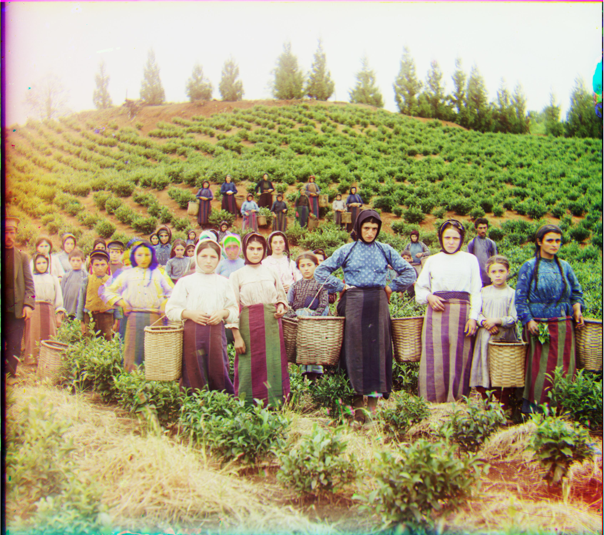
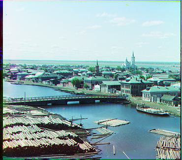

# Images of the Russian Empire: Colorizing the Prokudin-Gorskii photo collection

## Project Overview

The goal of this project is to take the digitized Prokudin-Gorskii glass plate images and, using image processing techniques, automatically produce a color image with as few visual artifacts as possible. In order to do this, we extract the three color channel images, place them on top of each other, and align them so that they form a single RGB color image.

## Approach
First, we separate the color channels by computing 1/3 of the total height of the original image, and we splice the image into 3 parts of equal height. To align the channels, we align both the red and green channels to the blue channel.

The alignment procedure uses an image pyramid, which allows the algorithm to process large images. We use the sum of squared differences (SSD) as the metric to compare alignment between channels — a lower SSD means the channels are more aligned. The procedure is as follows:

* If either dimension of the image size is less than 256, then exhaustively search a 16x15 set of possible displacements for the best alignment. Specifically, search in a range of [-16, 15] for both the x and y dimensions. Return the displacement vector (i, j) that gives the best SSD alignment.
* Else, rescale the image to half the height and half the width, and run the procedure again. After getting the result from the previous recursive case, make appropriate adjustments:
    * Multiply the result by 2 to account for scaling up the image size
    * Search in a 2x2 set of possible displacements for the best alignment around the result*2 from the previous case.
    * Return the displacement vector (i, j) that gives the best SSD alignment.

When calculating the best alignment, we cut off 10% of the image height off from the top and bottom, and 10% of the image width off from the left and right. This helped prevent differences in the channels' borders from affecting the alignment. However, my output images are using the uncropped channels; the alignment displacement vector should be the same regardless.

Here are some images generated with this approach:

    

        
        
cathedral  
        green align (2, 5)  
        red align (3, 12) 

    

    <!-- Image 2 -->
    

        
        
monastery  
        green align (2, -3)  
        red align (2, 3) 

    

    <!-- Image 3 -->
    

        
        
tobolsk  
        green align (3, 3)  
        red align (3, 6) 

    

    

        
        
harvesters  
        green align (16, 59)  
        red align (13, 124) 

    

    

        
        
icon  
        green align (17, 41)  
        red align (23, 90) 

    

    

        
        
lady  
        green align (8, 56)  
        red align (11, 116) 

    

    

        
        
melons  
        green align (11, 82)  
        red align (13, 178) 

    

    

        
        
onion_church  
        green align (27, 51)  
        red align (36, 108) 

    

    

        
        
sculpture  
        green align (-11, 33)  
        red align (-27, 140) 

    

    

        
        
self_portrait  
        green align (29, 79)  
        red align (37, 176) 

    

    

        
        
three_generations  
        green align (14, 53)  
        red align (11, 112) 

    

    

        
        
train  
        green align (6, 43)  
        red align (32, 87) 

    

    

        
        
church  
        green align (4, 25)  
        red align (267, 64) 

    

    

        
        
emir  
        green align (24, 49)  
        red align (57, 103) 

    

## Bells and Whistles

### Structural Similarity
As we can see in `emir.tif` and `church.tif` above, SSD does not perform well in certain situations. We ran alignment using `skimage.metrics.structural_similarity` (SSIM) instead, and it produced better results. SSIM uses a sliding window approach to compare structural similarity between local parts of the image as opposed to just performing one comparison over all pixels in the image.

Here are corrected images for `emir.tif` and `church.tif` using structural similarity.

    

        
        
church  
        green align (4, 25)  
        red align (-4, 58) 

    

    

        
        
emir  
        green align (23, 50)  
        red align (40, 105) 

    

SSIM might be more suited for these images because it doesn't operate on the RGB color space. In these images, one channel (e.g. blue for Emir's jacket) could be dominating over the other channels, which might be throwing off the SSD metric.

### Automatic Border Cropping
We implemented automatic border cropping to eliminate some of the black and white edges as well as residual alignment artifacts on the borders of images. 

The idea behind our border cropping algorithm is that pixels across all RGB channels should be fairly similar if they are actually part of the image, i.e. each channel in the image should agree with the others to some reasonable extent. To implement this, we computed the total absolute difference between all RBG channels. Then, for each row and column, we checked whether 70% of the pixels had a total absolute difference less than 1. If yes, then we kept that row/column, and if not, then we cropped it out.

We also cropped out black and white borders on our images. For each row and column, we checked if the mean of the RGB values was both greater than 0.08 and less than 0.94, since pixels with mean values outside of this range were either (sufficiently) black or white. If the mean of a row/column did not lie in this range, then we cropped out that row/column.

Cropped images are shown below the next section.

### Automatic Contrast
We implemented automatic contrast after cropping. We used `skimage.exposure.equalize_adapthist`, which is an algorithm for local contrast enhancement that uses histograms computed over different tile regions of the image. This algorithm allows local details to be enhanced even in regions that are darker or lighter than most of the image.

Complete results are shown below. The first column contains the original aligned images, the second column contains the cropped images, and the third column contains the cropped images after contrast. The images in the first column have red borders to show white edges that are cropped out by the automatic cropping algorithm.

    <!-- Empty top-left cell -->
    

    <!-- Column Labels -->
    
Original Aligned

    
Cropped

    
Contrasted

    
Row 1

    

    
    

    
Row 2

    

    
    

    
Row 3

    

    
    

    
Row 4

    

    
    

    
Row 5

    

    
    

    <!-- cathedral -->
    
Row 1

    

    
    

    <!-- church -->
    
Row 2

    

    
    

    <!-- Row 3 -->
    
Row 3

    

    
    

    <!-- Row 4 -->
    
Row 4

    

    
    

    <!-- Row 5 -->
    
Row 5

    

    
    

    <!-- cathedral -->
    
Row 1

    

    
    

    <!-- church -->
    
Row 2

    

    
    

    <!-- Row 3 -->
    
Row 3

    

    
    

    <!-- Row 4 -->
    
Row 4

    

    
    

