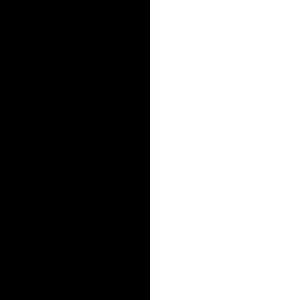
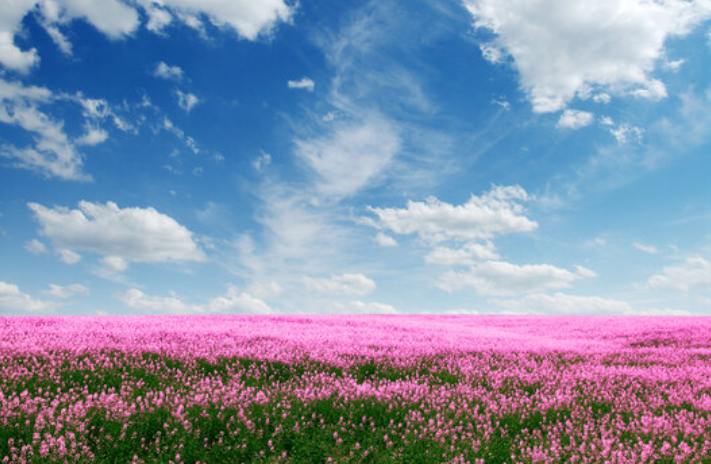
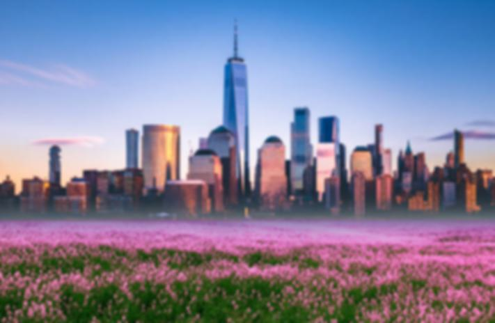
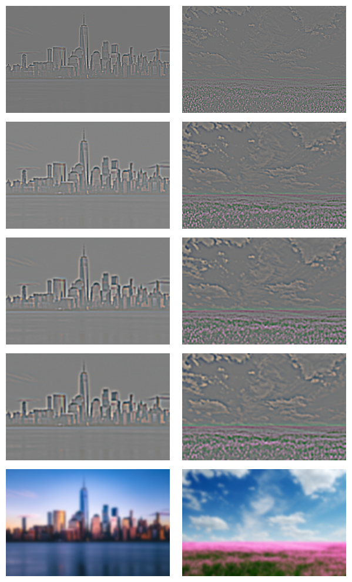
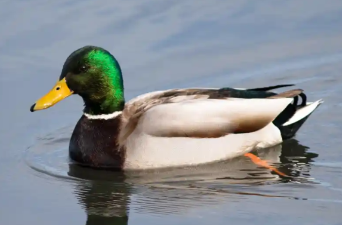
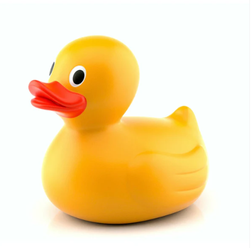
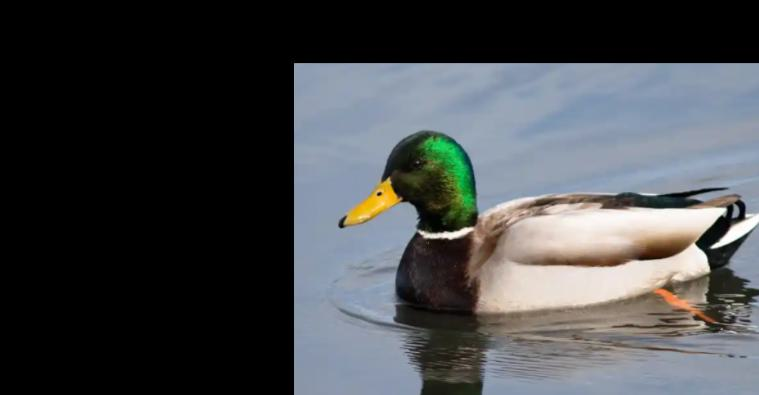
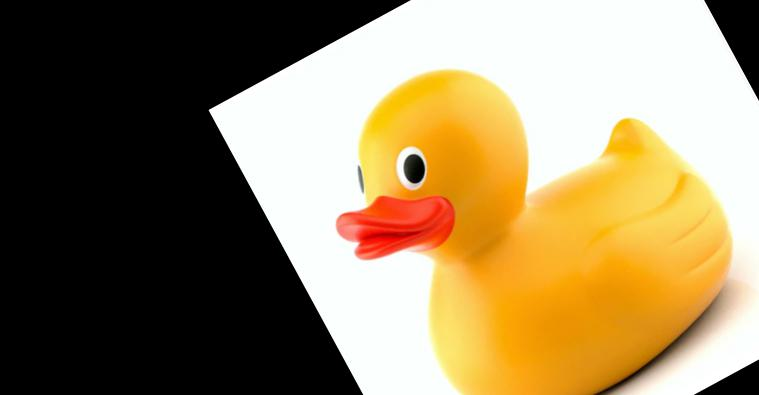
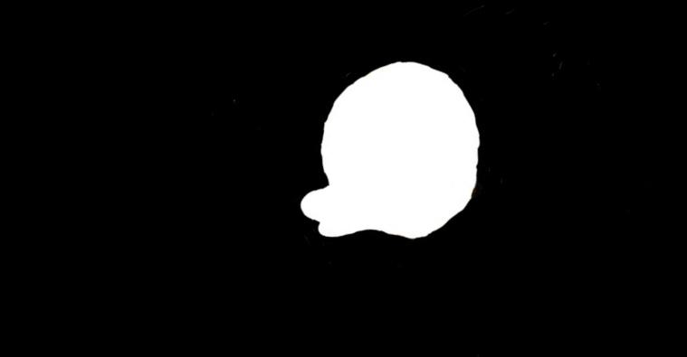
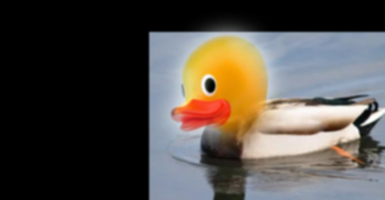

# Fun with Filters and Frequencies

## Part 1: Fun with Filters
### Part 1.1: Finite Difference Operator
We use the finite difference operators as defined below:
```
D_x = np.array([[1, -1]])
D_y = np.array([[1], [-1]])
```
Convolving these with the camera image using `scipy.signal.convolve2d` with `mode='same'` and `boundary='symm'`, we get the following images. For the binarized image, we used a threshold of 0.2. We computed the pixel-wise gradient magnitude using `np.sqrt(dx_deriv ** 2 + dy_deriv ** 2)`, which gets the L2 norm of the total gradient vector.

<div style="display: grid; grid-template-columns: repeat(2, 1fr); grid-gap: 10px; padding: 20px; max-width: 1200px; margin: auto; align-items: center; justify-items: center;">

    <div style="text-align: center;">
        
        <p style="margin-top: 5px; font-size: 14px; font-weight: bold; color: #333;">Partial x derivative </p>
    </div>

    <div style="text-align: center;">
        
        <p style="margin-top: 5px; font-size: 14px; font-weight: bold; color: #333;">Partial y derivative </p>
    </div>

    <div style="text-align: center;">
        
        <p style="margin-top: 5px; font-size: 14px; font-weight: bold; color: #333;">Gradient magnitude </p>
    </div>

    <div style="text-align: center;">
        
        <p style="margin-top: 5px; font-size: 14px; font-weight: bold; color: #333;">Binarized gradient magnitude with threshold 0.2 </p>
    </div>
</div>

### Part 1.2: Derivative of Gaussian (DoG) Filter
We blur the image by convolving it with a 2D Gaussian filter of kernel size 7 and standard deviation 1. Then, we repeat the procedure from part 1.1 on the blurred cameraman image.
<div style="display: grid; grid-template-columns: repeat(2, 1fr); grid-gap: 10px; padding: 20px; max-width: 1200px; margin: auto; align-items: center; justify-items: center;">

    <div style="text-align: center;">
        
        <p style="margin-top: 5px; font-size: 14px; font-weight: bold; color: #333;">Gradient magnitude </p>
    </div>

    <div style="text-align: center;">
        
        <p style="margin-top: 5px; font-size: 14px; font-weight: bold; color: #333;">Binarized gradient magnitude with threshold 0.1 </p>
    </div>
</div>

Comparing this to the results in part 1.1, we see that these images are much less noisy, and the edges in the image appear more clear, thick, and rounded. The noisy edges at the bottom of the image are also gone. This is because the blurring the initial image removes the high frequency components of the image since the Gaussian filter is a low pass filter. This eliminates noise and causes edge detection to be more accurate.

We check that we get the same results by convolving the gaussian with `D_x` and `D_y` first.

<div style="display: grid; grid-gap: 10px; padding: 20px; max-width: 1200px; margin: auto; align-items: center; justify-items: center;">

    <div style="text-align: center;">
        
        <p style="margin-top: 5px; font-size: 14px; font-weight: bold; color: #333;"></p>
    </div>
</div>

We convolve these "derivative of Gaussian" filters with our original image (unblurred) to get the images below.

<div style="display: grid; grid-template-columns: repeat(2, 1fr); grid-gap: 10px; padding: 20px; max-width: 1200px; margin: auto; align-items: center; justify-items: center;">

    <div style="text-align: center;">
        
        <p style="margin-top: 5px; font-size: 14px; font-weight: bold; color: #333;">Gradient magnitude </p>
    </div>

    <div style="text-align: center;">
        
        <p style="margin-top: 5px; font-size: 14px; font-weight: bold; color: #333;">Binarized gradient magnitude with threshold 0.1 </p>
    </div>
</div>

The images look almost exactly the same as the images we got after blurring the image and then applying `D_x` and `D_y`, so these two techniques have the same effect.

## Part 2: Fun with Frequencies
### Part 2.1: Image "Sharpening"

We "sharpen" an image following this procedure:
1. Convolve the image with a Gaussian kernel to get the low frequencies of the image
2. Calculate the high frequencies using `details = original - blurred`
3. Get the sharpened image using `sharpened = original + alpha * details`

For the Taj Mahal image, we used a Gaussian kernel size 7, Gaussian standard deviation 1, and `alpha = 2`.

For the dog image, we used Gaussian kernel size 9, Gaussian standard deviation 1.5, and `alpha = 2`.

<div style="display: grid; grid-template-columns: repeat(2, 1fr); grid-gap: 10px; padding: 20px; max-width: 1200px; margin: auto; align-items: center; justify-items: center;">

    <div style="text-align: center;">
        
        <p style="margin-top: 5px; font-size: 14px; font-weight: bold; color: #333;">Original Taj Mahal image</p>
    </div>

    <div style="text-align: center;">
        
        <p style="margin-top: 5px; font-size: 14px; font-weight: bold; color: #333;">Sharpened Taj Mahal image </p>
    </div>

    <div style="text-align: center;">
        
        <p style="margin-top: 5px; font-size: 14px; font-weight: bold; color: #333;">Original dog image</p>
    </div>

    <div style="text-align: center;">
        
        <p style="margin-top: 5px; font-size: 14px; font-weight: bold; color: #333;">Sharpened dog image </p>
    </div>
</div>

We blur the sharpened dog image and attempt to resharpen it afterwards. To blur, we used Gaussian kernel size 5 and standard deviation 1. To resharpen, we used Gaussian kernel size 7, Gaussian standard deviation 1, and `alpha = 2`.

<div style="display: grid; grid-template-columns: repeat(2, 1fr); grid-gap: 10px; padding: 20px; max-width: 1200px; margin: auto; align-items: center; justify-items: center;">

    <div style="text-align: center;">
        
        <p style="margin-top: 5px; font-size: 14px; font-weight: bold; color: #333;">Blurred sharpened dog image</p>
    </div>

    <div style="text-align: center;">
        
        <p style="margin-top: 5px; font-size: 14px; font-weight: bold; color: #333;">Resharpened dog image </p>
    </div>
</div>

Some features in the resharpened image look sharpened compared to the original dog image, such as the cracks in the ground and the stairs in the background. However, there are many edges and details that still appear blurred, such as the dog's fur. This is because blurring the sharpened image removes the high frequency content. When we try to sharpen the image after blurring, there is not as much high frequency content to add back to the image, so the standard sharpening process does not work properly.

### Part 2.2: Hybrid Images
We create hybrid images by combining the low frequencies of one image with the high frequencies of another image. This allows the hybrid image to show the high-frequency image when the viewer is close, and it shows the low-frequency image when the viewer is farther away.

To get the low frequency image, we apply a Gaussian blur. To get the high frequency image, we apply a Gaussian blur and then calculate `details = original - blurred`, and we use `details` as the high frequencies. We then average the low and high frequency images pixel-wise to obtain the final hybrid image.

<div style="display: grid; grid-template-columns: repeat(3, 1fr); grid-gap: 10px; padding: 20px; max-width: 1200px; margin: auto; align-items: center; justify-items: center;">

    <div style="font-weight: bold;">Low Frequency Image</div>
    <div style="font-weight: bold;">High Frequency Image</div>
    <div style="font-weight: bold;">Hybrid Image</div>

    <div style="text-align: center;">
        
        <p style="margin-top: 5px; font-size: 14px; font-weight: bold; color: #333;">Derek </p>
    </div>

    <div style="text-align: center;">
        
        <p style="margin-top: 5px; font-size: 14px; font-weight: bold; color: #333;">Nutmeg </p>
    </div>

    <div style="text-align: center;">
        
        <p style="margin-top: 5px; font-size: 14px; font-weight: bold; color: #333;">
        Low frequency: kernel size 41, stdev 6 <br>
        High frequency: kernel size 55, stdev 7</p>
    </div>

    <div style="text-align: center;">
        
        <p style="margin-top: 5px; font-size: 14px; font-weight: bold; color: #333;">Smiski researching</p>
    </div>

    <div style="text-align: center;">
        
        <p style="margin-top: 5px; font-size: 14px; font-weight: bold; color: #333;">Smiski presenting </p>
    </div>

    <div style="text-align: center;">
        
        <p style="margin-top: 5px; font-size: 14px; font-weight: bold; color: #333;">
        Low frequency: kernel size 41, stdev 6 <br>
        High frequency: kernel size 15, stdev 2.5</p>
    </div>

    <div style="text-align: center;">
        
        <p style="margin-top: 5px; font-size: 14px; font-weight: bold; color: #333;">Leafeon (Pokemon)</p>
    </div>

    <div style="text-align: center;">
        
        <p style="margin-top: 5px; font-size: 14px; font-weight: bold; color: #333;">Sylveon (Pokemon)</p>
    </div>

    <div style="text-align: center;">
        
        <p style="margin-top: 5px; font-size: 14px; font-weight: bold; color: #333;">
        Low frequency: kernel size 41, stdev 6 <br>
        High frequency: kernel size 15, stdev 2</p>
    </div>
</div>

For the Smiskis, the eyes of the high-frequency Smiski still show up pretty clearly even when looking at the hybrid image from far away, since the eyes are very dark compared to the rest of the Smiski's face and body. Otherwise, the hybrid images seem to work.

We do Fourier analyis on the Leafeon/Sylveon hybrid.

<div style="display: grid; grid-template-columns: repeat(2, 1fr); grid-gap: 10px; padding: 20px; max-width: 1200px; margin: auto; align-items: center; justify-items: center;">

    <div style="text-align: center;">
        
        <p style="margin-top: 5px; font-size: 14px; font-weight: bold; color: #333;">Leafeon FFT</p>
    </div>

    <div style="text-align: center;">
        
        <p style="margin-top: 5px; font-size: 14px; font-weight: bold; color: #333;">Sylveon FFT </p>
    </div>

    <div style="text-align: center;">
        
        <p style="margin-top: 5px; font-size: 14px; font-weight: bold; color: #333;">Low frequency Leafeon FFT</p>
    </div>

    <div style="text-align: center;">
        
        <p style="margin-top: 5px; font-size: 14px; font-weight: bold; color: #333;">High frequency Sylveon FFT</p>
    </div>
</div>

<div style="display: grid; grid-template-columns: repeat(1, 1fr); grid-gap: 10px; padding: 20px; max-width: 1200px; margin: auto; align-items: center; justify-items: center;">
    <div style="text-align: center;">
        
        <p style="margin-top: 5px; font-size: 14px; font-weight: bold; color: #333;">Hybrid image FFT</p>
    </div>
</div>

For a failure case, we try to make a hybrid of a paper crane and a real crane.

<div style="display: grid; grid-template-columns: repeat(3, 1fr); grid-gap: 10px; padding: 20px; max-width: 1200px; margin: auto; align-items: center; justify-items: center;">

    <div style="font-weight: bold;">Low Frequency Image</div>
    <div style="font-weight: bold;">High Frequency Image</div>
    <div style="font-weight: bold;">Hybrid Image</div>

    <div style="text-align: center;">
        
        <p style="margin-top: 5px; font-size: 14px; font-weight: bold; color: #333;">Paper crane </p>
    </div>

    <div style="text-align: center;">
        
        <p style="margin-top: 5px; font-size: 14px; font-weight: bold; color: #333;">Real crane </p>
    </div>

    <div style="text-align: center;">
        
        <p style="margin-top: 5px; font-size: 14px; font-weight: bold; color: #333;">
        Low frequency: kernel size 41, stdev 6 <br>
        High frequency: kernel size 35, stdev 5</p>
    </div>
</div>

The crane hybrid does not really work because the dark lines of the paper crane are still very visible when viewing the image up close. These are high frequency components that don't get blurred out enough by the Gaussian filter.

### Bells and Whistles: Color
We try using color on the Leafeon/Sylveon hybrid to see if color will enhance the hybrid effect.

<div style="display: grid; grid-template-columns: repeat(2, 1fr); grid-gap: 10px; padding: 20px; max-width: 1200px; margin: auto; align-items: center; justify-items: center;">

    <div style="text-align: center;">
        
        <p style="margin-top: 5px; font-size: 14px; font-weight: bold; color: #333;">Both grayscale </p>
    </div>

    <div style="text-align: center;">
        
        <p style="margin-top: 5px; font-size: 14px; font-weight: bold; color: #333;">Leafeon color, Sylveon grayscale </p>
    </div>

    <div style="text-align: center;">
        
        <p style="margin-top: 5px; font-size: 14px; font-weight: bold; color: #333;">Leafeon grayscale, Sylveon color</p>
    </div>

    <div style="text-align: center;">
        
        <p style="margin-top: 5px; font-size: 14px; font-weight: bold; color: #333;">Both color</p>
    </div>
</div>

Color does not seem to enhance the effect very much. In particular, using color for the high frequency image seems insignificant, since the process of subtracting the blurred image from the original already removes so much of the image's color. Using color for the low frequency image does not seem to make the hybrid effect better than just using grayscale.

### Part 2.3: Gaussian and Laplacian Stacks
We create Gaussian and Laplacian stacks for both the apple and orange images. At every level of the Gaussian stack, we use a Gaussian kernel to blur the previous level to get the current level's output, which maintains the image's size across all levels of the stack. Each level of the Laplacian stack except for the last level is calculated from the Gaussian stack using `l_stack[i] = g_stack[i] - g_stack[i+1]`. For the last level of the Laplacian stack, we directly use the result from the last level of the Gaussian stack. This means that both stacks end up with the same number of images.

Here are levels 0, 2, 4, 6, and 7 of my Laplacian stack, where we use a total of 8 layers (so layer 7 is the last). These levels are shown from top to bottom. From left to right, the columns are: apple, orange, masked apple, masked orange, combined masked apple + masked orange.

<div style="display: grid; grid-template-columns: repeat(1, 1fr); grid-gap: 10px; padding: 20px; max-width: 1200px; margin: auto; align-items: center; justify-items: center;">

    <div style="text-align: center;">
        
        <p style="margin-top: 5px; font-size: 14px; font-weight: bold; color: #333;"></p>
    </div>
</div>

Each Laplacian stack image shown here is normalized (over the entire image, not by channel). However, when doing the multiresolution blending, we use the un-normalized versions of the Laplacian stack outputs.

### Part 2.4: Multiresolution Blending
To blend two images `A` and `B` together, we generate the Laplacian stacks for each of these images `A_lstack` and `B_lstack`. We also generate a Gaussian stack for the mask `mask_gstack`. To combine the images with a smooth blend, we compute `(1 - mask_gstack[i]) * A_lstack[i] + mask_gstack[i] * B_lstack[i]` for each level `i` in the respective stack, and we add all of these contributions together. This works because `1 - mask_gstack[i]` reverses the mask, so the contribution from `A` is the "excluded" part of the original mask and the contribution from `B` is the "included" part of the original mask. The final output image has a smooth overall blend because we blend each band of frequencies through the Laplacian stack. We normalize the result for the final output.

All of these blends are done with 8 stack layers. The parameters used for generating the Gaussian stack (and therefore the Laplacian stack) are stated in the caption under each image.

In the images below, we added a red border around the masks to better show where the white part of the mask is.

<div style="display: grid; grid-template-columns: repeat(4, 1fr); grid-gap: 10px; padding: 20px; max-width: 1200px; margin: auto; align-items: center; justify-items: center;">

    <div style="font-weight: bold;">Image 1</div>
    <div style="font-weight: bold;">Image 2</div>
    <div style="font-weight: bold;">Mask</div>
    <div style="font-weight: bold;">Blended image</div>

    <div style="text-align: center;">
        
        <p style="margin-top: 5px; font-size: 14px; font-weight: bold; color: #333;">Apple <br>
        Gaussian stack kernel size 7 <br>
        stdev 2</p>
    </div>

    <div style="text-align: center;">
        
        <p style="margin-top: 5px; font-size: 14px; font-weight: bold; color: #333;">Orange <br>
        Gaussian stack kernel size 7 <br>
        stdev 2</p>
    </div>

    <div style="text-align: center;">
        
        <p style="margin-top: 5px; font-size: 14px; font-weight: bold; color: #333;"> Vertical mask <br>
        Gaussian stack kernel size 31 <br>
        stdev 15</p>
    </div>

    <div style="text-align: center;">
        
        <p style="margin-top: 5px; font-size: 14px; font-weight: bold; color: #333;">Blend <br>
        Apple <br>
        Orange</p>
    </div>

    <div style="text-align: center;">
        
        <p style="margin-top: 5px; font-size: 14px; font-weight: bold; color: #333;">New York City <br>
        Gaussian stack kernel size 7 <br>
        stdev 2</p>
    </div>

    <div style="text-align: center;">
        
        <p style="margin-top: 5px; font-size: 14px; font-weight: bold; color: #333;">Flower field <br>
        Gaussian stack kernel size 7 <br>
        stdev 2</p>
    </div>

    <div style="text-align: center;">
        
        <p style="margin-top: 5px; font-size: 14px; font-weight: bold; color: #333;">
        Horizontal mask <br>
        Gaussian stack kernel size 7 <br> stdev 2</p>
    </div>

    <div style="text-align: center;">
        
        <p style="margin-top: 5px; font-size: 14px; font-weight: bold; color: #333;">Blend <br>
        New York City <br>
        Flower field</p>
    </div>
</div>

Here are the Laplacian stack images for the flower city. These are levels 0, 2, 4, 6, and 7 of the Laplacian stacks, where we use a total of 8 layers (so layer 7 is the last). From left to right, the columns are: city, flower field, masked city, masked flower field, combined masked city + masked flower field.

<div style="display: grid; grid-template-columns: repeat(1, 1fr); grid-gap: 10px; padding: 20px; max-width: 1200px; margin: auto; align-items: center; justify-items: center;">

    <div style="text-align: center;">
        
        <p style="margin-top: 5px; font-size: 14px; font-weight: bold; color: #333;"></p>
    </div>
</div>

For my irregular mask, I blended a rubber duck's head with a real duck.

<div style="display: grid; grid-template-columns: repeat(2, 1fr); grid-gap: 10px; padding: 20px; max-width: 1200px; margin: auto; align-items: center; justify-items: center;">

    <div style="text-align: center;">
        
        <p style="margin-top: 5px; font-size: 14px; font-weight: bold; color: #333;">Original real duck</p>
    </div>

    <div style="text-align: center;">
        
        <p style="margin-top: 5px; font-size: 14px; font-weight: bold; color: #333;">Original rubber duck</p>
    </div>

    <div style="text-align: center;">
        
        <p style="margin-top: 5px; font-size: 14px; font-weight: bold; color: #333;">Aligned real duck <br>
        Gaussian stack kernel size 7 <br>
        stdev 2</p>
    </div>

    <div style="text-align: center;">
        
        <p style="margin-top: 5px; font-size: 14px; font-weight: bold; color: #333;">Aligned rubber duck <br>
        Gaussian stack kernel size 7 <br>
        stdev 2</p>
    </div>

    <div style="text-align: center;">
        
        <p style="margin-top: 5px; font-size: 14px; font-weight: bold; color: #333;">Irregular mask <br>
        Gaussian stack kernel size 31 <br>
        stdev 9</p>
    </div>

    <div style="text-align: center;">
        
        <p style="margin-top: 5px; font-size: 14px; font-weight: bold; color: #333;">Blend <br>
        Real duck <br>
        Rubber duck</p>
    </div>

## Reflection
 The most important thing I learned during this project was how different frequencies in images affect our perception of those images. It was fun playing around with frequencies to blend images together, and I liked creating hybrid images that showed me how we see high frequencies close up and low frequencies from far away. I learned a lot about how changing frequencies can impact what we see in images.
</div>
