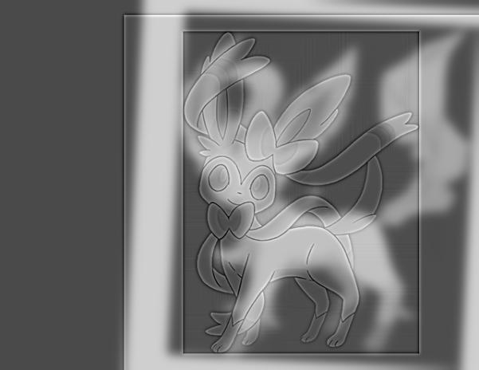
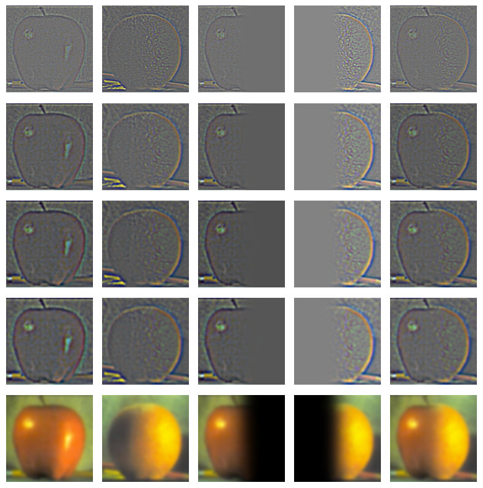

# Fun with Filters and Frequencies

## Part 1: Fun with Filters
### Part 1.1: Finite Difference Operator
We use the finite difference operators as defined below:
```
D_x = np.array([[1, -1]])
D_y = np.array([[1], [-1]])
```
Convolving these with the camera image using `scipy.signal.convolve2d` with `mode='same'` and `boundary='symm'`, we get the following images. For the binarized image, we used a threshold of 0.2.

<div style="display: grid; grid-template-columns: repeat(2, 1fr); grid-gap: 10px; padding: 20px; max-width: 1200px; margin: auto; align-items: center; justify-items: center;">

    <div style="text-align: center;">
        
        <p style="margin-top: 5px; font-size: 14px; font-weight: bold; color: #333;">Partial x derivative </p>
    </div>

    <div style="text-align: center;">
        
        <p style="margin-top: 5px; font-size: 14px; font-weight: bold; color: #333;">Partial y derivative </p>
    </div>

    <div style="text-align: center;">
        
        <p style="margin-top: 5px; font-size: 14px; font-weight: bold; color: #333;">Gradient magnitude </p>
    </div>

    <div style="text-align: center;">
        
        <p style="margin-top: 5px; font-size: 14px; font-weight: bold; color: #333;">Binarized gradient magnitude with threshold 0.2 </p>
    </div>
</div>

### Part 1.2: Derivative of Gaussian (DoG) Filter
We blur the image by convolving it with a 2D Gaussian filter of kernel size 7 and standard deviation 1. Then, we repeat the procedure from part 1.1 on the blurred cameraman image.
<div style="display: grid; grid-template-columns: repeat(2, 1fr); grid-gap: 10px; padding: 20px; max-width: 1200px; margin: auto; align-items: center; justify-items: center;">

    <div style="text-align: center;">
        
        <p style="margin-top: 5px; font-size: 14px; font-weight: bold; color: #333;">Gradient magnitude </p>
    </div>

    <div style="text-align: center;">
        
        <p style="margin-top: 5px; font-size: 14px; font-weight: bold; color: #333;">Binarized gradient magnitude with threshold 0.1 </p>
    </div>
</div>

Comparing this to the results in part 1.1, we see that these images are much less noisy, and they capture the information about the edges in the image more cleanly and clearly. The gradient magnitude images look much smoother after we blur the image initially. This is because the Gaussian filter is a low pass filter, so it removes the high frequency components of the image, eliminating noise and causing edge detection to be more accurate.

We check that we get the same results by convolving the gaussian with `D_x` and `D_y` first.

<div style="display: grid; grid-gap: 10px; padding: 20px; max-width: 1200px; margin: auto; align-items: center; justify-items: center;">

    <div style="text-align: center;">
        
        <p style="margin-top: 5px; font-size: 14px; font-weight: bold; color: #333;"></p>
    </div>
</div>

We convolve these "derivative of Gaussian" filters with our original image (unblurred) to get the images below.

<div style="display: grid; grid-template-columns: repeat(2, 1fr); grid-gap: 10px; padding: 20px; max-width: 1200px; margin: auto; align-items: center; justify-items: center;">

    <div style="text-align: center;">
        
        <p style="margin-top: 5px; font-size: 14px; font-weight: bold; color: #333;">Gradient magnitude </p>
    </div>

    <div style="text-align: center;">
        
        <p style="margin-top: 5px; font-size: 14px; font-weight: bold; color: #333;">Binarized gradient magnitude with threshold 0.1 </p>
    </div>
</div>

The images are the same as the images we got after blurring the image and then applying `D_x` and `D_y`, so these two techniques have the same effect.

## Part 2: Fun with Frequencies
### Part 2.1: Image "Sharpening"

We "sharpen" an image following this procedure:
1. Convolve the image with a Gaussian kernel to get the low frequencies of the image
2. Calculate the high frequencies using `details = original - blurred`
3. Get the sharpened image using `sharpened = original + alpha * details`

For my Taj Mahal image, we used a Gaussian kernel size 7, Gaussian standard deviation 1, and `alpha = 2`.

For my dog image, we used Gaussian kernel size 9, Gaussian standard deviation 1.5, and `alpha = 2`.

<div style="display: grid; grid-template-columns: repeat(2, 1fr); grid-gap: 10px; padding: 20px; max-width: 1200px; margin: auto; align-items: center; justify-items: center;">

    <div style="text-align: center;">
        
        <p style="margin-top: 5px; font-size: 14px; font-weight: bold; color: #333;">Original Taj Mahal image</p>
    </div>

    <div style="text-align: center;">
        
        <p style="margin-top: 5px; font-size: 14px; font-weight: bold; color: #333;">Sharpened Taj Mahal image </p>
    </div>

    <div style="text-align: center;">
        
        <p style="margin-top: 5px; font-size: 14px; font-weight: bold; color: #333;">Original dog image</p>
    </div>

    <div style="text-align: center;">
        
        <p style="margin-top: 5px; font-size: 14px; font-weight: bold; color: #333;">Sharpened dog image </p>
    </div>
</div>

We blur the sharpened dog image and attempt to resharpen it afterwards. To blur, we used Gaussian kernel size 5 and standard deviation 1. To resharpen, we used Gaussian kernel size 7, Gaussian standard deviation 1, and `alpha = 2`.

<div style="display: grid; grid-template-columns: repeat(2, 1fr); grid-gap: 10px; padding: 20px; max-width: 1200px; margin: auto; align-items: center; justify-items: center;">

    <div style="text-align: center;">
        
        <p style="margin-top: 5px; font-size: 14px; font-weight: bold; color: #333;">Blurred sharpened dog image</p>
    </div>

    <div style="text-align: center;">
        
        <p style="margin-top: 5px; font-size: 14px; font-weight: bold; color: #333;">Resharpened dog image </p>
    </div>
</div>

We can see that although some features in the resharpened image look sharpened compared to the original dog image, there are many edges and details that are still blurred. This is because blurring the sharpened image removes the high frequency content. When we try to sharpen the image after blurring, there is not as much high frequency content to add back to the image, so the standard sharpening process does not work properly.

### Part 2.2: Hybrid Images
We create hybrid images by combining the low frequencies of one image with the high frequencies of another image. This allows the hybrid image to show the high-frequency image when the viewer is close, and it shows the low-frequency image when the viewer is farther away.

To get the low frequency image, we apply a Gaussian blur. To get the high frequency image, we apply a Gaussian blur, and then do `details = original - blurred`. We then average the low and high frequency images to obtain the final hybrid image.

<div style="display: grid; grid-template-columns: repeat(3, 1fr); grid-gap: 10px; padding: 20px; max-width: 1200px; margin: auto; align-items: center; justify-items: center;">

    <div style="font-weight: bold;">Low Frequency Image</div>
    <div style="font-weight: bold;">High Frequency Image</div>
    <div style="font-weight: bold;">Hybrid Image</div>

    <div style="text-align: center;">
        
        <p style="margin-top: 5px; font-size: 14px; font-weight: bold; color: #333;">Derek </p>
    </div>

    <div style="text-align: center;">
        
        <p style="margin-top: 5px; font-size: 14px; font-weight: bold; color: #333;">Nutmeg </p>
    </div>

    <div style="text-align: center;">
        
        <p style="margin-top: 5px; font-size: 14px; font-weight: bold; color: #333;">
        Low frequency: kernel size 41, stdev 6 <br>
        High frequency: kernel size 55, stdev 7</p>
    </div>

    <div style="text-align: center;">
        
        <p style="margin-top: 5px; font-size: 14px; font-weight: bold; color: #333;">Smiski researching</p>
    </div>

    <div style="text-align: center;">
        
        <p style="margin-top: 5px; font-size: 14px; font-weight: bold; color: #333;">Smiski presenting </p>
    </div>

    <div style="text-align: center;">
        
        <p style="margin-top: 5px; font-size: 14px; font-weight: bold; color: #333;">
        Low frequency: kernel size 41, stdev 6 <br>
        High frequency: kernel size 15, stdev 2.5</p>
    </div>

    <div style="text-align: center;">
        
        <p style="margin-top: 5px; font-size: 14px; font-weight: bold; color: #333;">Leafeon (Pokemon)</p>
    </div>

    <div style="text-align: center;">
        
        <p style="margin-top: 5px; font-size: 14px; font-weight: bold; color: #333;">Sylveon (Pokemon)</p>
    </div>

    <div style="text-align: center;">
        
        <p style="margin-top: 5px; font-size: 14px; font-weight: bold; color: #333;">
        Low frequency: kernel size 41, stdev 6 <br>
        High frequency: kernel size 15, stdev 2</p>
    </div>
</div>

For the Smiskis, the eyes of the high-frequency Smiski still show up pretty clearly even when looking at the hybrid image from far away, since the eyes are very dark compared to the rest of the Smiski's face and body. Otherwise, the hybrid images seem to work.

We do Fourier analyis on the Leafeon/Sylveon hybrid.

<div style="display: grid; grid-template-columns: repeat(2, 1fr); grid-gap: 10px; padding: 20px; max-width: 1200px; margin: auto; align-items: center; justify-items: center;">

    <div style="text-align: center;">
        
        <p style="margin-top: 5px; font-size: 14px; font-weight: bold; color: #333;">Leafeon FFT</p>
    </div>

    <div style="text-align: center;">
        
        <p style="margin-top: 5px; font-size: 14px; font-weight: bold; color: #333;">Sylveon FFT </p>
    </div>

    <div style="text-align: center;">
        
        <p style="margin-top: 5px; font-size: 14px; font-weight: bold; color: #333;">Low frequency Leafeon FFT</p>
    </div>

    <div style="text-align: center;">
        
        <p style="margin-top: 5px; font-size: 14px; font-weight: bold; color: #333;">High frequency Sylveon FFT</p>
    </div>
</div>

<div style="display: grid; grid-template-columns: repeat(1, 1fr); grid-gap: 10px; padding: 20px; max-width: 1200px; margin: auto; align-items: center; justify-items: center;">
    <div style="text-align: center;">
        
        <p style="margin-top: 5px; font-size: 14px; font-weight: bold; color: #333;">Hybrid image FFT</p>
    </div>
</div>

For a failure case, we try to make a hybrid of a paper crane and a real crane.

<div style="display: grid; grid-template-columns: repeat(3, 1fr); grid-gap: 10px; padding: 20px; max-width: 1200px; margin: auto; align-items: center; justify-items: center;">

    <div style="font-weight: bold;">Low Frequency Image</div>
    <div style="font-weight: bold;">High Frequency Image</div>
    <div style="font-weight: bold;">Hybrid Image</div>

    <div style="text-align: center;">
        
        <p style="margin-top: 5px; font-size: 14px; font-weight: bold; color: #333;">Paper crane </p>
    </div>

    <div style="text-align: center;">
        
        <p style="margin-top: 5px; font-size: 14px; font-weight: bold; color: #333;">Real crane </p>
    </div>

    <div style="text-align: center;">
        
        <p style="margin-top: 5px; font-size: 14px; font-weight: bold; color: #333;">
        Low frequency: kernel size 41, stdev 6 <br>
        High frequency: kernel size 35, stdev 5</p>
    </div>
</div>

The crane hybrid does not really work because the dark lines of the paper crane are still very visible when viewing the image up close. These are high frequency components that don't get blurred out enough by the Gaussian filter.

### Bells and Whistles: Color
We try using color on the Leafeon/Sylveon hybrid to see if color will enhance the hybrid effect.

<div style="display: grid; grid-template-columns: repeat(2, 1fr); grid-gap: 10px; padding: 20px; max-width: 1200px; margin: auto; align-items: center; justify-items: center;">

    <div style="text-align: center;">
        
        <p style="margin-top: 5px; font-size: 14px; font-weight: bold; color: #333;">Both grayscale </p>
    </div>

    <div style="text-align: center;">
        
        <p style="margin-top: 5px; font-size: 14px; font-weight: bold; color: #333;">Leafeon color, Sylveon grayscale </p>
    </div>

    <div style="text-align: center;">
        
        <p style="margin-top: 5px; font-size: 14px; font-weight: bold; color: #333;">Leafeon grayscale, Sylveon color</p>
    </div>

    <div style="text-align: center;">
        
        <p style="margin-top: 5px; font-size: 14px; font-weight: bold; color: #333;">Both color</p>
    </div>
</div>

Color does not seem to enhance the effect very much. In particular, using color for the high frequency image seems insignificant, since the process of subtracting the blurred image from the original already removes so much of the image's color. Using color for the low frequency image does not seem to make the hybrid effect better than just using grayscale.

### Part 2.3: Gaussian and Laplacian Stacks
We create Gaussian and Laplacian stacks for both the apple and orange images. At every level of the Gaussian stack, we use a Gaussian kernel to blur the previous level to get the current level's output, which maintains the image's size across all levels of the stack. Each level of the Laplacian stack except for the last level is calculated from the Gaussian stack using `l_stack[i] = g_stack[i] - g_stack[i+1]`. For the last level of the Laplacian stack, we directly use the result from the last level of the Gaussian stack. This means that both stacks end up with the same number of images.

Here are levels 0, 2, 4, 6, and 7 of my Laplacian stack, where I used a total of 8 layers (so layer 7 is the last). These levels are shown from top to bottom, with the apple images on the left column and the orange on the right. I used 

<div style="display: grid; grid-template-columns: repeat(1, 1fr); grid-gap: 10px; padding: 20px; max-width: 1200px; margin: auto; align-items: center; justify-items: center;">

    <div style="text-align: center;">
        
        <p style="margin-top: 5px; font-size: 14px; font-weight: bold; color: #333;"></p>
    </div>
</div>

Each Laplacian stack image shown here is normalized (over the entire image, not by channel), but when doing the multiresolution blending, we use the un-normalized version of the Laplacian stack outputs.

### Part 2.4: Multiresolution Blending
To blend two images `A` and `B` together, we generate the Laplacian stacks for each of these images `A_lstack` and `B_lstack`. We also generate a Gaussian stack for the mask `mask_gstack` after initially blurring the mask to soften the abrupt mask edges. To combine the images with a smooth blend, we compute `(1 - mask_gstack[i]) * A_lstack[i] + mask_gstack[i] * B_lstack[i]` for each level `i` in the respective stack, and we add all of these contributions together. This works because `(1 - mask_gstack[i])` reverses the mask, so the contribution from `A` is the "excluded" part of the original mask and the contribution from `B` in the "included" part of the original mask. We create the smooth overall blend on the final output image by blending each band of frequencies through the Laplacian stack. We normalize the result for the final output.

All of these blends are done with 8 stack layers. The parameters used for generating the Gaussian stack (and therefore the Laplacian stack) for each image are stated in the caption under each image.

<div style="display: grid; grid-template-columns: repeat(4, 1fr); grid-gap: 10px; padding: 20px; max-width: 1200px; margin: auto; align-items: center; justify-items: center;">

    <div style="font-weight: bold;">Image 1</div>
    <div style="font-weight: bold;">Image 2</div>
    <div style="font-weight: bold;">Mask</div>
    <div style="font-weight: bold;">Blended image</div>

    <div style="text-align: center;">
        
        <p style="margin-top: 5px; font-size: 14px; font-weight: bold; color: #333;">Apple <br>
        Gaussian stack kernel size 7 <br>
        stdev 2</p>
    </div>

    <div style="text-align: center;">
        
        <p style="margin-top: 5px; font-size: 14px; font-weight: bold; color: #333;">Orange <br>
        Gaussian stack kernel size 7 <br>
        stdev 2</p>
    </div>

    <div style="text-align: center;">
        
        <p style="margin-top: 5px; font-size: 14px; font-weight: bold; color: #333;">Vertical Mask<br>
        Initial blurring Gaussian kernel size 51, stdev 16 <br>
        Gaussian stack kernel size 31, stdev 15</p>
    </div>

    <div style="text-align: center;">
        
        <p style="margin-top: 5px; font-size: 14px; font-weight: bold; color: #333;"></p>
    </div>
</div>


Here are some images generated with this approach.

<div style="display: grid; grid-template-columns: repeat(2, 1fr); grid-gap: 10px; padding: 20px; max-width: 1200px; margin: auto; align-items: center; justify-items: center;">

    <div style="text-align: center;">
        
        <p style="margin-top: 5px; font-size: 14px; font-weight: bold; color: #333;">cathedral <br>
        green align (2, 5) <br>
        red align (3, 12) </p>
    </div>

    <!-- Image 2 -->
    <div style="text-align: center;">
        
        <p style="margin-top: 5px; font-size: 14px; font-weight: bold; color: #333;">monastery <br>
        green align (2, -3) <br>
        red align (2, 3) </p>
    </div>

    <!-- Image 3 -->
    <div style="text-align: center;">
        
        <p style="margin-top: 5px; font-size: 14px; font-weight: bold; color: #333;">tobolsk <br>
        green align (3, 3) <br>
        red align (3, 6) </p>
    </div>

    <div style="text-align: center;">
        
        <p style="margin-top: 5px; font-size: 14px; font-weight: bold; color: #333;">harvesters <br>
        green align (16, 59) <br>
        red align (13, 124) </p>
    </div>

    <div style="text-align: center;">
        
        <p style="margin-top: 5px; font-size: 14px; font-weight: bold; color: #333;">icon <br>
        green align (17, 41) <br>
        red align (23, 90) </p>
    </div>

    <div style="text-align: center;">
        
        <p style="margin-top: 5px; font-size: 14px; font-weight: bold; color: #333;">lady <br>
        green align (8, 56) <br>
        red align (11, 116) </p>
    </div>

    <div style="text-align: center;">
        
        <p style="margin-top: 5px; font-size: 14px; font-weight: bold; color: #333;">melons <br>
        green align (11, 82) <br>
        red align (13, 178) </p>
    </div>

    <div style="text-align: center;">
        
        <p style="margin-top: 5px; font-size: 14px; font-weight: bold; color: #333;">onion_church <br>
        green align (27, 51) <br>
        red align (36, 108) </p>
    </div>

    <div style="text-align: center;">
        
        <p style="margin-top: 5px; font-size: 14px; font-weight: bold; color: #333;">sculpture <br>
        green align (-11, 33) <br>
        red align (-27, 140) </p>
    </div>

    <div style="text-align: center;">
        
        <p style="margin-top: 5px; font-size: 14px; font-weight: bold; color: #333;">self_portrait <br>
        green align (29, 79) <br>
        red align (37, 176) </p>
    </div>

    <div style="text-align: center;">
        
        <p style="margin-top: 5px; font-size: 14px; font-weight: bold; color: #333;">three_generations <br>
        green align (14, 53) <br>
        red align (11, 112) </p>
    </div>

    <div style="text-align: center;">
        
        <p style="margin-top: 5px; font-size: 14px; font-weight: bold; color: #333;">train <br>
        green align (6, 43) <br>
        red align (32, 87) </p>
    </div>

    <div style="text-align: center;">
        
        <p style="margin-top: 5px; font-size: 14px; font-weight: bold; color: #333;">church <br>
        green align (4, 25) <br>
        red align (267, 64) </p>
    </div>

    <div style="text-align: center;">
        
        <p style="margin-top: 5px; font-size: 14px; font-weight: bold; color: #333;">emir <br>
        green align (24, 49) <br>
        red align (57, 103) </p>
    </div>
</div>

## Bells and Whistles

### Structural Similarity
As we can see in `emir.tif` and `church.tif` above, SSD does not perform well in certain situations. We ran the alignment procedure using `skimage.metrics.structural_similarity` (SSIM) instead, and it produced better results. SSIM uses a sliding window approach to compare structural similarity between local parts of the image as opposed to just performing one comparison over all pixels in the image.

Here are corrected images for `emir.tif` and `church.tif` using structural similarity.

<div style="display: grid; grid-template-columns: repeat(2, 1fr); grid-gap: 10px; padding: 20px; max-width: 1200px; margin: auto; align-items: center; justify-items: center;">

    <div style="text-align: center;">
        
        <p style="margin-top: 5px; font-size: 14px; font-weight: bold; color: #333;">church <br>
        green align (4, 25) <br>
        red align (-4, 58) </p>
    </div>

    <div style="text-align: center;">
        
        <p style="margin-top: 5px; font-size: 14px; font-weight: bold; color: #333;">emir <br>
        green align (23, 50) <br>
        red align (40, 105) </p>
    </div>
</div>

SSIM might be more suited for these images because it doesn't operate on the RGB color space. In these images, one channel might be dominating over the other channels (e.g. blue in Emir's jacket), which might be throwing off the SSD metric.

### Automatic Border Cropping
We implemented automatic border cropping to eliminate some of the black and white edges as well as residual alignment artifacts on the borders of images. 

The idea behind our border cropping algorithm is that pixels across all RGB channels should be fairly similar if they are actually part of the image, i.e. each channel in the image should agree with the others to some reasonable extent. To implement this, we computed the total absolute difference between all RBG channels. Then, for each row and column, we checked whether 70% of the pixels had a total absolute difference less than 1. If yes, then we kept that row/column, and if not, then we cropped it out.

We also cropped out black and white borders on our images. For each row and column, we checked if the mean of the RGB values was both greater than 0.08 and less than 0.94, since pixels with mean values outside of this range were either (sufficiently) black or white. If the mean of a row/column did not lie in this range, then we cropped out that row/column.

Here are a few original and cropped images. The images have red borders to show white edges that are cropped out by the automatic cropping algorithm.

<div style="display: grid; grid-template-columns: auto repeat(2, 1fr); grid-gap: 10px; padding: 20px; max-width: 1200px; margin: auto; align-items: center; justify-items: center;">
    <!-- Empty top-left cell -->
    <div></div>

    <!-- Column Labels -->
    <div style="font-weight: bold;">Original Aligned</div>
    <div style="font-weight: bold;">Cropped</div>

    <div style="font-weight: bold;">lady</div>
    <div></div>
    

    <div style="font-weight: bold;">melons</div>
    <div></div>
    

    <div style="font-weight: bold;">onion_church</div>
    <div></div>
    

    <div style="font-weight: bold;">self_portrait</div>
    <div></div>
    
</div>

### Automatic Contrast
After cropping, we implemented automatic contrast. We used `skimage.exposure.equalize_adapthist`, which is an algorithm for local contrast enhancement that uses histograms computed over different tile regions of the image. This algorithm allows local details to be enhanced even in regions that are darker or lighter than most of the image.

Here are a few images shown before and after contrast.

<div style="display: grid; grid-template-columns: auto repeat(2, 1fr); grid-gap: 10px; padding: 20px; max-width: 1200px; margin: auto; align-items: center; justify-items: center;">
    <!-- Empty top-left cell -->
    <div></div>

    <!-- Column Labels -->
    <div style="font-weight: bold;">Before</div>
    <div style="font-weight: bold;">After</div>

    <div style="font-weight: bold;">cathedral</div>
    
    

    <div style="font-weight: bold;">harvesters</div>
    
    

    <div style="font-weight: bold;">self_portrait</div>
    <div></div>
    
</div>

### Appendix

Complete results are shown below. The first column contains the original aligned images, the second column contains the cropped images, and the third column contains the cropped images after contrast. The images in the first two columns have red borders to show white edges that are cropped out by the automatic cropping algorithm.

<div style="display: grid; grid-template-columns: auto repeat(3, 1fr); grid-gap: 10px; padding: 20px; max-width: 1600px; margin: auto; align-items: center; justify-items: center;">
    <!-- Empty top-left cell -->
    <div></div>

    <!-- Column Labels -->
    <div style="font-weight: bold;">Original Aligned</div>
    <div style="font-weight: bold;">Cropped</div>
    <div style="font-weight: bold;">Contrasted</div>

    <div style="font-weight: bold;">cathedral</div>
    <div></div>
    
    

    <div style="font-weight: bold;">church</div>
    <div></div>
    
    

    <div style="font-weight: bold;">emir</div>
    <div></div>
    
    

    <div style="font-weight: bold;">harvesters</div>
    <div></div>
    
    

    <div style="font-weight: bold;">icon</div>
    <div></div>
    
    

    <div style="font-weight: bold;">lady</div>
    <div></div>
    
    

    <div style="font-weight: bold;">melons</div>
    <div></div>
    
    

    <div style="font-weight: bold;">monastery</div>
    <div></div>
    
    

    <div style="font-weight: bold;">onion_church</div>
    <div></div>
    
    

    <div style="font-weight: bold;">sculpture</div>
    <div></div>
    
    

    <div style="font-weight: bold;">self_portrait</div>
    <div></div>
    
    

    <div style="font-weight: bold;">three_generations</div>
    <div></div>
    
    

    <div style="font-weight: bold;">tobolsk</div>
    <div></div>
    
    

    <div style="font-weight: bold;">train</div>
    <div></div>
    
    
</div>
