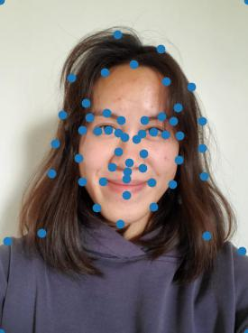

# Face Morphing

## Overview
In this project, we produce a "morph" animation of two faces, compute the mean of a population of faces, and extrapolate from a population mean to create a caricature.

## Part 1: Defining Correspondences
I wanted to morph myself and my friend Kerrine. I used the provided [labeling tool](https://cal-cs180.github.io/fa23/hw/proj3/tool.html) to label 56 correspondence points between my face and Kerrine's face. Four of these points were the four corners of the image.

    

        
        
Me (Christine) 

    

    

        
        
My friend Kerrine 

    

    
    

        
        
My face with correspondence points 

    

    

        
        
Kerrine's face with correspondence points 

    

I then took the average of our correspondence points and used `scipy.spatial.Delaunay` to compute the Delaunay triangulation of the average correspondence points. The resulting triangulation imposed on our faces is shown below.

    

        
        
Me with average triangulation 

    

    

        
        
Kerrine with average triangulation 

    

## Part 2: Computing the Mid-Way Face
To compute the mid-way face using `warp_frac=0.5` and `dissolve_frac=0.5`, I used the following process:

1. Calculate the average points using `(1-warp_frac) * points1 + warp_frac * points2`.
2. Get the Delaunay triangulation of the average points.
3. For each triangle, compute an affine transformation matrix between that triangle in each of the original images and its corresponding triangle in the Delaunay average triangulation. This matrix is used for warping the images.
4. Get the average triangle's pixels using `skimage.draw.polygon`.
5. Find the pixels in each of the original images corresponding to the average triangle by taking the inverse of the affine transformation matrix computed in step 3.
6. Cross dissolve these pixels to get the final face image using `(1-dissolve_frac) * img1[y1, x1] + dissolve_frac * img2[y2, x2]`.

    

        
        
Me 

    

    

        
        
My friend Kerrine 

    

    

        
        
Mid-way face 

    

## Part 3: The Morph Sequence
I created the morph sequence by varying `warp_frac` and `dissolve_frac` from 0 to 1 in the procedure described above. `warp_frac = dissolve_frac = 0` is my face, and `warp_frac = dissolve_frac = 1` is Kerrine's face.

    

        
        

    

## Part 4: The Mean Face of a Population
We create hybrid images by combining the low frequencies of one image with the high frequencies of another image. This allows the hybrid image to show the high-frequency image when the viewer is close, and it shows the low-frequency image when the viewer is farther away.

To get the low frequency image, we apply a Gaussian blur. To get the high frequency image, we apply a Gaussian blur and then calculate `details = original - blurred`, and we use `details` as the high frequencies. We then average the low and high frequency images pixel-wise to obtain the final hybrid image.

    
Low Frequency Image

    
High Frequency Image

    
Hybrid Image

    

        
        
Derek 

    

    

        
        
Nutmeg 

    

    

        
        

        Low frequency: kernel size 41, stdev 6  
        High frequency: kernel size 55, stdev 7

    

    

        
        
Smiski researching

    

    

        
        
Smiski presenting 

    

    

        
        

        Low frequency: kernel size 41, stdev 6  
        High frequency: kernel size 15, stdev 2.5

    

    

        
        
Leafeon (Pokemon)

    

    

        
        
Sylveon (Pokemon)

    

    

        
        

        Low frequency: kernel size 41, stdev 6  
        High frequency: kernel size 15, stdev 2

    

For the Smiskis, the eyes of the high-frequency Smiski still show up pretty clearly even when looking at the hybrid image from far away, since the eyes are very dark compared to the rest of the Smiski's face and body. Otherwise, the hybrid images seem to work.

We do Fourier analyis on the Leafeon/Sylveon hybrid.

    

        
        
Leafeon FFT

    

    

        
        
Sylveon FFT 

    

    

        
        
Low frequency Leafeon FFT

    

    

        
        
High frequency Sylveon FFT

    

    

        
        
Hybrid image FFT

    

For a failure case, we try to make a hybrid of a paper crane and a real crane.

    
Low Frequency Image

    
High Frequency Image

    
Hybrid Image

    

        
        
Paper crane 

    

    

        
        
Real crane 

    

    

        
        

        Low frequency: kernel size 41, stdev 6  
        High frequency: kernel size 35, stdev 5

    

The crane hybrid does not really work because the dark lines of the paper crane are still very visible when viewing the image up close. These are high frequency components that don't get blurred out enough by the Gaussian filter.

### Bells and Whistles: Color
We try using color on the Leafeon/Sylveon hybrid to see if color will enhance the hybrid effect.

    

        
        
Both grayscale 

    

    

        
        
Leafeon color, Sylveon grayscale 

    

    

        
        
Leafeon grayscale, Sylveon color

    

    

        
        
Both color

    

Color does not seem to enhance the effect very much. In particular, using color for the high frequency image seems insignificant, since the process of subtracting the blurred image from the original already removes so much of the image's color. Using color for the low frequency image does not seem to make the hybrid effect better than just using grayscale.

## Part 2.3: Gaussian and Laplacian Stacks
We create Gaussian and Laplacian stacks for both the apple and orange images. At every level of the Gaussian stack, we use a Gaussian kernel to blur the previous level to get the current level's output, which maintains the image's size across all levels of the stack. Each level of the Laplacian stack except for the last level is calculated from the Gaussian stack using `l_stack[i] = g_stack[i] - g_stack[i+1]`. For the last level of the Laplacian stack, we directly use the result from the last level of the Gaussian stack. This means that both stacks end up with the same number of images.

Here are levels 0, 2, 4, 6, and 7 of my Laplacian stack, where we use a total of 8 layers (so layer 7 is the last). These levels are shown from top to bottom. From left to right, the columns are: apple, orange, masked apple, masked orange, combined masked apple + masked orange.

    

        
        

    

Each Laplacian stack image shown here is normalized (over the entire image, not by channel). However, when doing the multiresolution blending, we use the un-normalized versions of the Laplacian stack outputs.

## Part 2.4: Multiresolution Blending
To blend two images `A` and `B` together, we generate the Laplacian stacks for each of these images `A_lstack` and `B_lstack`. We also generate a Gaussian stack for the mask `mask_gstack`. To combine the images with a smooth blend, we compute `(1 - mask_gstack[i]) * A_lstack[i] + mask_gstack[i] * B_lstack[i]` for each level `i` in the respective stack, and we add all of these contributions together. This works because `1 - mask_gstack[i]` reverses the mask, so the contribution from `A` is the "excluded" part of the original mask and the contribution from `B` is the "included" part of the original mask. The final output image has a smooth overall blend because we blend each band of frequencies through the Laplacian stack. We normalize the result for the final output.

All of these blends are done with 8 stack layers. The parameters used for generating the Gaussian stack (and therefore the Laplacian stack) are stated in the caption under each image.

In the images below, we added a red border around the masks to better show where the white part of the mask is.

    
Image 1

    
Image 2

    
Mask

    
Blended image

    

        
        
Apple  
        Gaussian stack kernel size 7  
        stdev 2

    

    

        
        
Orange  
        Gaussian stack kernel size 7  
        stdev 2

    

    

        
        
 Vertical mask  
        Gaussian stack kernel size 31  
        stdev 15

    

    

        
        
Blend  
        Apple  
        Orange

    

    

        
        
New York City  
        Gaussian stack kernel size 7  
        stdev 2

    

    

        
        
Flower field  
        Gaussian stack kernel size 7  
        stdev 2

    

    

        
        

        Horizontal mask  
        Gaussian stack kernel size 7   stdev 2

    

    

        
        
Blend  
        New York City  
        Flower field

    

Here are the Laplacian stack images for the flower city. These are levels 0, 2, 4, 6, and 7 of the Laplacian stacks, where we use a total of 8 layers (so layer 7 is the last). From left to right, the columns are: city, flower field, masked city, masked flower field, combined masked city + masked flower field.

    

        
        

    

For my irregular mask, I blended a rubber duck's head with a real duck.

    

        
        
Original real duck

    

    

        
        
Original rubber duck

    

    

        
        
Aligned real duck  
        Gaussian stack kernel size 7  
        stdev 2

    

    

        
        
Aligned rubber duck  
        Gaussian stack kernel size 7  
        stdev 2

    

    

        
        
Irregular mask  
        Gaussian stack kernel size 31  
        stdev 9

    

    

        
        
Blend  
        Real duck  
        Rubber duck

    

## Reflection
 The most important thing I learned during this project was how different frequencies in images affect our perception of those images. It was fun playing around with frequencies to blend images together, and I liked creating hybrid images that showed me how we see high frequencies close up and low frequencies from far away. I learned a lot about how changing frequencies can impact what we see in images.
