# Face Morphing

## Overview
In this project, we produce a "morph" animation of two faces, compute the mean of a population of faces, and extrapolate from a population mean to create a caricature.

## Part 1: Defining Correspondences
I wanted to morph myself and my friend Kerrine. I used the provided [labeling tool](https://cal-cs180.github.io/fa23/hw/proj3/tool.html) to label 56 correspondence points between my face and Kerrine's face. Four of these points were the four corners of the image.

    

        
        
Me (Christine) 

    

    

        
        
My friend Kerrine 

    

    
    

        
        
My face with correspondence points 

    

    

        
        
Kerrine's face with correspondence points 

    

    

        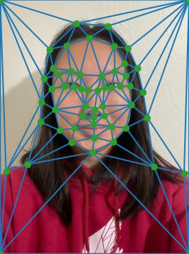
        
My face with triangulation 

    

    

        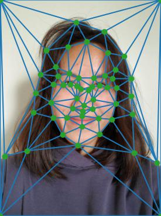
        
Kerrine's face with triangulation 

    

I then took the average of our correspondence points and used `scipy.spatial.Delaunay` to compute the Delaunay triangulation of the average correspondence points. The resulting triangulation imposed on our faces is shown below.

    

        
        
Me with average triangulation 

    

    

        
        
Kerrine with average triangulation 

    

## Part 2: Computing the Mid-Way Face
To compute the mid-way face using `warp_frac=0.5` and `dissolve_frac=0.5`, I used the following process:

1. Calculate the average points using `(1-warp_frac) * points1 + warp_frac * points2`.
2. Get the Delaunay triangulation of the average points.
3. For each triangle, compute an affine transformation matrix between that triangle in each of the original images and its corresponding triangle in the Delaunay average triangulation. This matrix is used for warping the images.
4. Get the average triangle's pixels using `skimage.draw.polygon`.
5. Find the pixels in each of the original images corresponding to the average triangle by taking the inverse of the affine transformation matrix computed in step 3.
6. Cross dissolve these pixels to get the final face image using `(1-dissolve_frac) * img1[y1, x1] + dissolve_frac * img2[y2, x2]`.

    

        
        
Me 

    

    

        
        
My friend Kerrine 

    

    

        
        
Mid-way face 

    

## Part 3: The Morph Sequence
I created the morph sequence by varying `warp_frac` and `dissolve_frac` from 0 to 1 in the procedure described above. `warp_frac = dissolve_frac = 0` is my face, and `warp_frac = dissolve_frac = 1` is Kerrine's face.

    

        
        

    

## Part 4: The Mean Face of a Population
I used photographs from the [FEI Face Database](https://fei.edu.br/~cet/facedatabase.html), which contains images of 200 individuals' faces taken at the Artificial Intelligence Laboratory of FEI in São Bernardo do Campo, São Paulo, Brazil. There are 100 male and 100 female subjects, with ages ranging from 19 to 40 years. Each individual has a neutral face image and a smiling face image.

Here are the images of person 1 in the dataset.

    

        
        
Neutral 

    

    

        
        
Smiling 

    

These photos are spatially normalized. The database also contains annotations of these faces with 46 correspondence points.

To compute the mean neutral and mean smiling face of the population, I used the following procedure:

1. Get the average face shape by taking the average of the 46 correspondence points across all 200 images. Add the four corners of the image dimensions as 4 extra correspondence points.
2. Warp each face into the average face shape using the procedure from part 2, but instead of having a second face image as the target, use the average shape correspondence points.
3. Take the average color of all the warped images to get the final mean face image.

    

        
        
Mean neutral face

    

    

        
        
Mean smiling face

    

Here are some of the dataset faces warped into the average face.

    
Original image

    
Warped to average

    

        
        
Person 88, neutral 

    

    

        
        
Person 88, warped to mean neutral 

    

    

        
        
Person 156, neutral

    

    

        
        
Person 156, warped to mean neutral 

    

    

        
        
Person 188, neutral

    

    

        
        
Person 188, warped to mean neutral 

    

    

        
        
Person 88, smiling 

    

    

        
        
Person 88, warped to mean smiling 

    

    

        
        
Person 156, smiling

    

    

        
        
Person 156, warped to mean smiling 

    

    

        
        
Person 188, smiling

    

    

        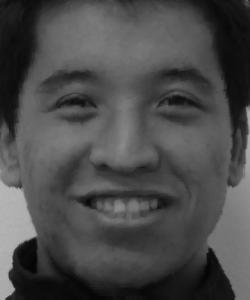
        
Person 188, warped to mean smiling 

    

Here is my face warped into the average geometry as well as the average face warped into my geometry. I labeled points on my face in the same order and location as the correspondence points in the FEI dataset.

    

        
        
Me

    

    

        
        
Me warped to mean neutral face 

    

    

        
        
Me warped to mean smiling face

    

    

        
        
Mean neutral face warped to my geometry

    

    

        
        
Mean smiling face warped to my geometry

    

## Part 5: Caricatures — Extrapolating from the Mean
I created a caricature of my face by calculating extrapolated correspondence points and warping my face to the triangulation formed by those points. I computed `p + 1.4(q - p)` for the extrapolated correspondence points, where `p` denotes the correspondence points on my face and `q` denotes the correspondence points on the mean face of the FEI dataset.

    

        
        
My caricature using mean neutral face

    

    

        
        
My caricature using mean smiling face

    

The top left of my face at the hairline has some artifacts. This is likely because the point labeling on the FEI dataset does not have any points on the forehead or hairline, so it is not warped as cleanly as the rest of the face.

## Bells and Whistles: Principal Component Analysis
I took each `m x n` image and represented it as a vector of length `m * n` (for the FEI dataset, this was `300 * 250`). The entire dataset can then be represented as a `k x (m * n)` matrix, where `k` is the number of images in the dataset. I performed PCA on this matrix using `sklearn.decomposition.PCA` to obtain the eigenfaces for the FEI dataset.

Here are the eigenfaces in order of decreasing eigenvalue for the neutral and smiling faces.

    

        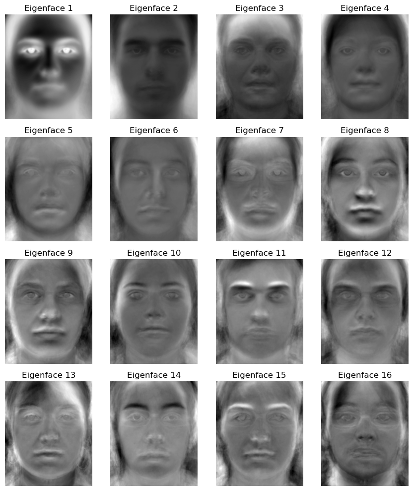
        
Neutral eigenfaces

    

    

        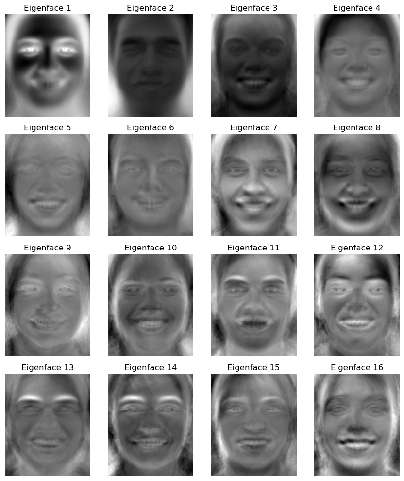
        
Smiling eigenfaces

    

I used the eigenface basis to generate some new face images. I multiplied each of the first 32 eigenfaces by a random weight in the range `(-1, 1)` and normalized the result to obtain a new face.

Here are some newly generated neutral faces.

    

        
        

    

    

        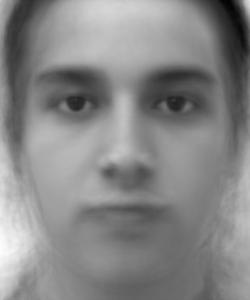
        

    

    

        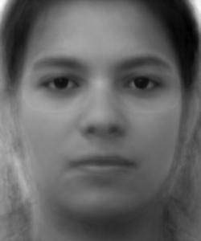
        

    

Some of the results were pretty discolored due to the random weights that were chosen. Here are some randomly generated neutral faces that don't look as good.

    

        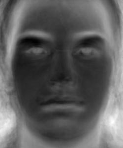
        

    

    

        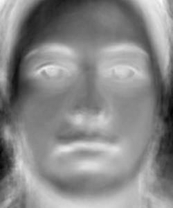
        

    

    

        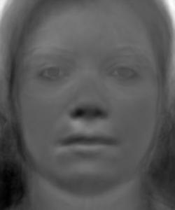
        

    

Here are some newly generated smiling faces.

    

        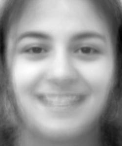
        

    

    

        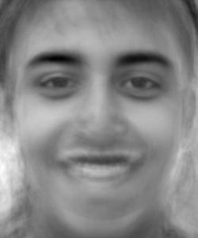
        

    

    

        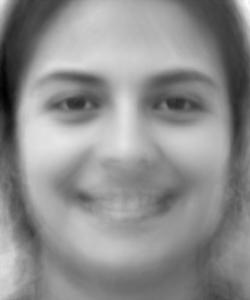
        

    

In these images, we can see that the mouth area is a bit blurry. I think this is because the smiling faces have more variation in where the mouth is compared to the neutral faces, so the first 32 components of the PCA basis are unable to capture this information as accurately for the smiling faces. Otherwise, the images look fairly realistic.
