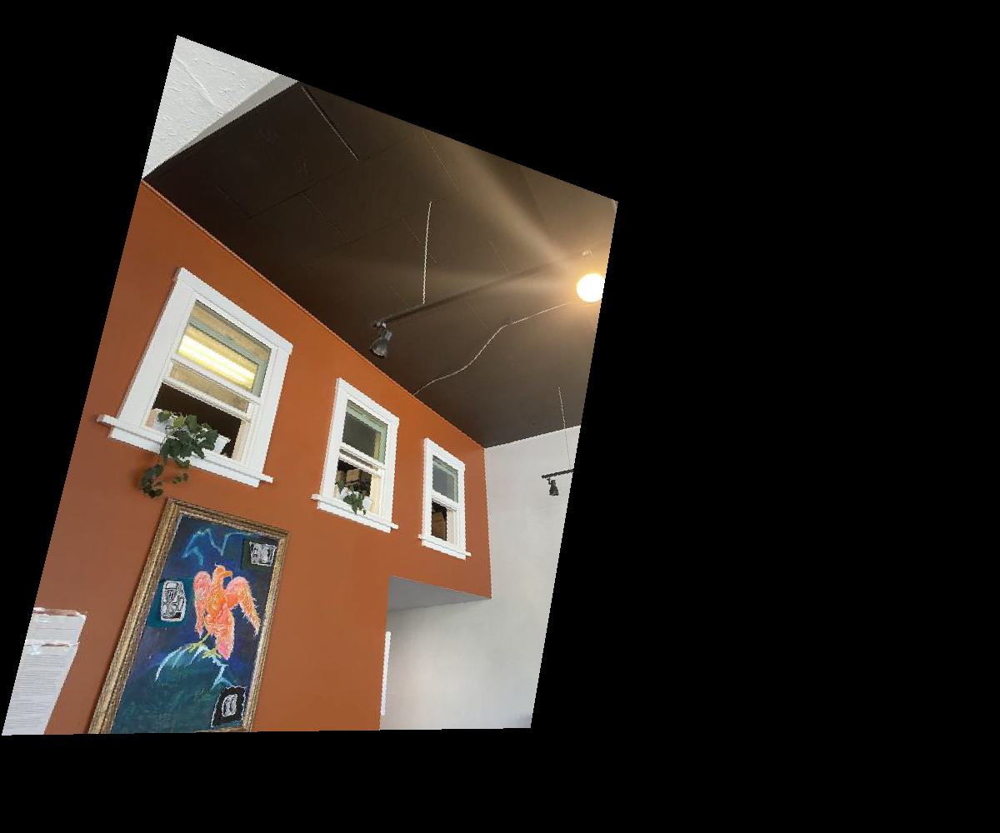
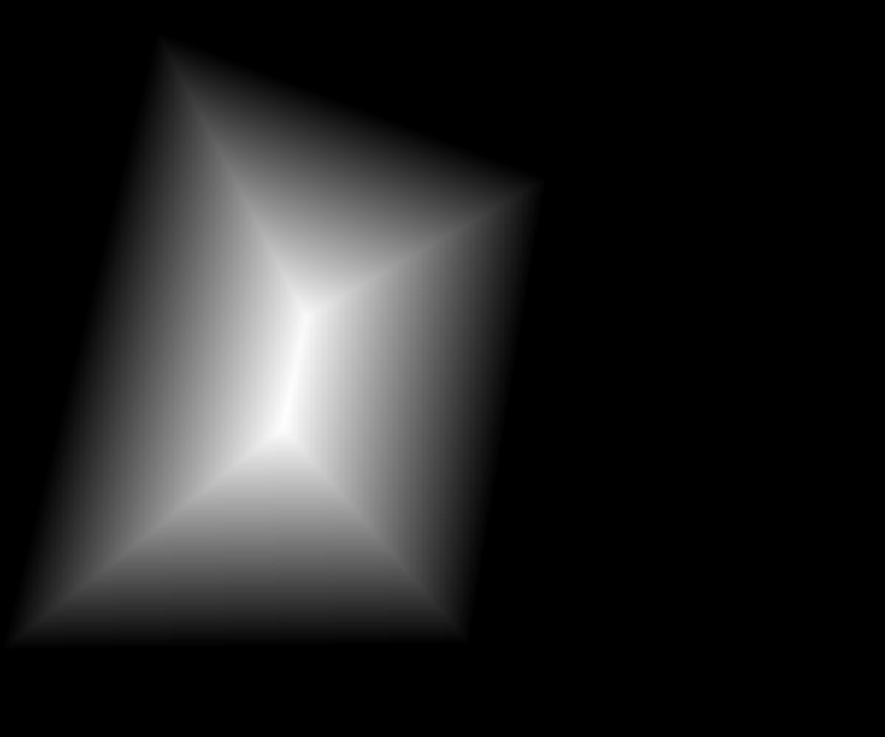
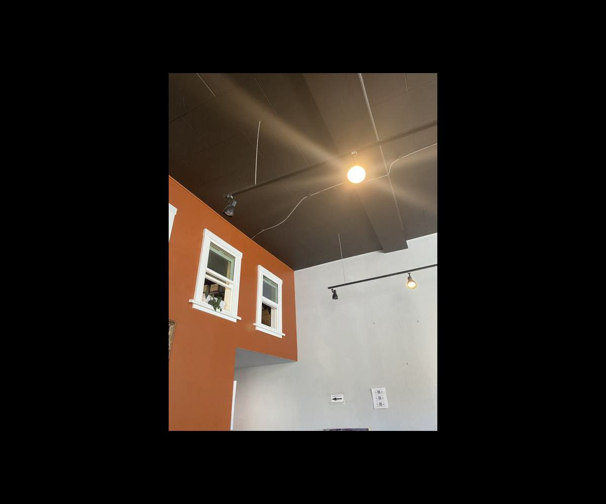
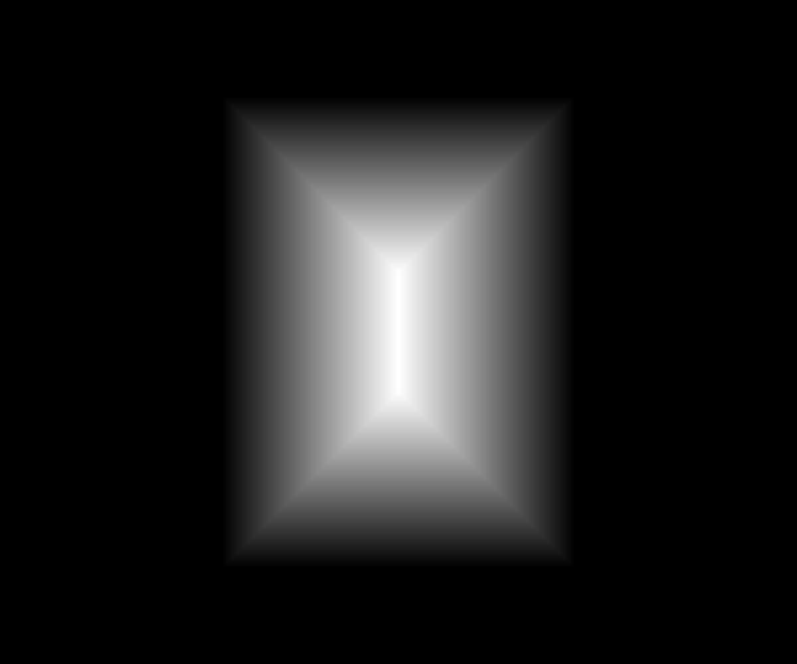
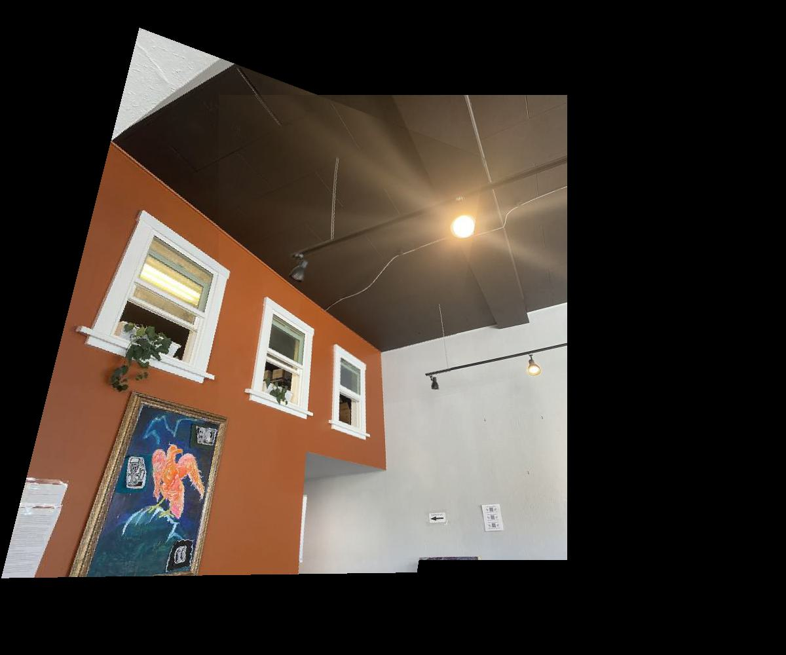
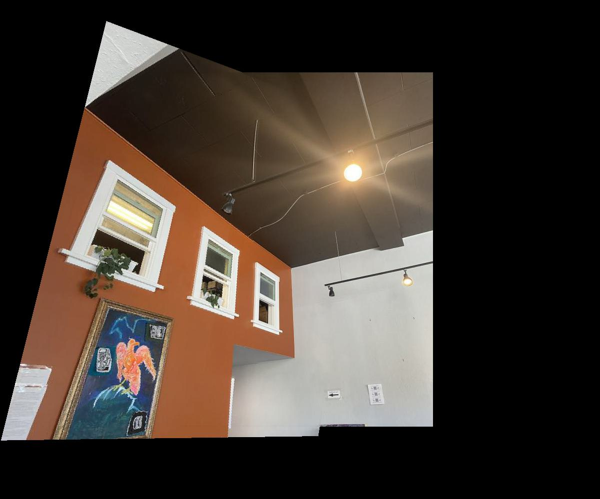
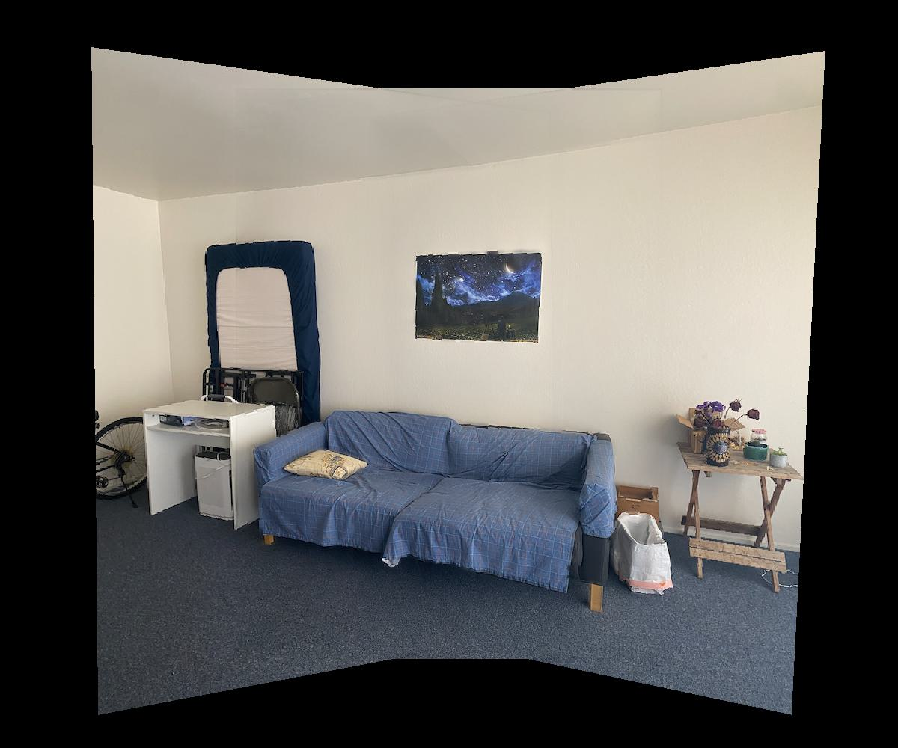
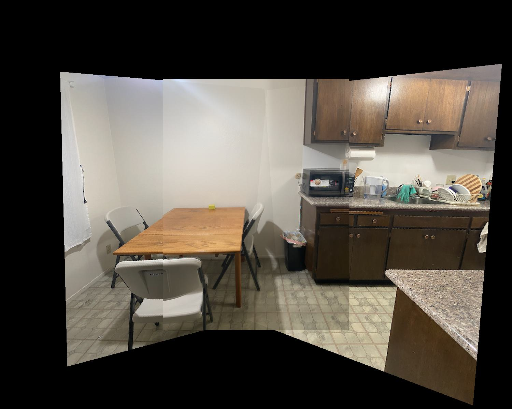
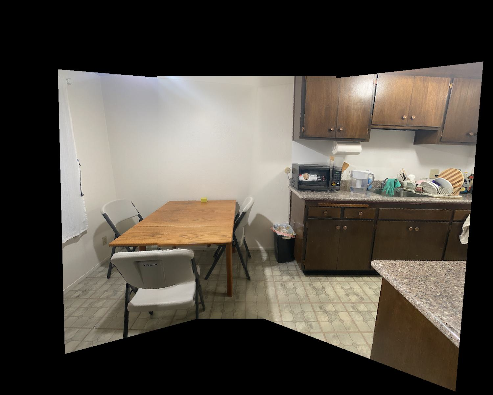

# Image Warping and Mosaicing

## Shoot Pictures
For the mosaics, I took pictures in Souvenir Coffee on College Avenue, in my living room, and in my kitchen. I shot these with my iPhone 11 Pro.

Souvenir Coffee:

    

        
        
 

    

    

        
        
 

    

My living room:

    

        
        
 

    

    

        
        

    

    

        
        

    

My kitchen:

    

        
        
 

    

    

        
        

    

    

        
        

    

## Recover Homographies
I defined correspondences in pairs of images. Let's call the points in the source image $$(x_i, y_i)$$ and the corresponding points in the target image $$(x_i', y_i')$$. Here are the correspondence points for the photos taken in Souvenir Coffee.

    

        
        

    

    

        
        

    

We want to recover the 3x3 transformation matrix in this equation relating $$(x, y)$$ to $$(x', y')$$.

$$
\begin{bmatrix}
a & b & c \\
d & e & f \\
g & h & 1
\end{bmatrix}
\begin{bmatrix}
x \\
y \\
1
\end{bmatrix}
=
\begin{bmatrix}
wx' \\
wy' \\
w6
\end{bmatrix}
$$

Expanding the matrix multiplication into a system of equations, we get

$$
ax + by + c = wx' \\
dx + ey + f = wy' \\
gx + hy + 1 = w
$$

We can use the last equation here as an expression for $$w$$. Substituting this into the first two equations, we get

$$
ax + by + c = (gx + hy + 1)x' \\
dx + ey + f = (gx + hy + 1)y'
$$

We can rewrite this so that we have $$x'$$ and $$y'$$ by themselves on the RHS of the equation:

$$
ax + by + c - gx'x - hy'x' = x' \\
dx + ey + f - gx'y' - hy'y' = y'
$$

This gives the matrix equation:

$$
\begin{bmatrix}
x & y & 1 & 0 & 0 & 0 & -xx' & -yx' \\
0 & 0 & 0 & x & y & 1 & -xy' & -yy'
\end{bmatrix}
\begin{bmatrix}
a \\
b \\
c \\
d \\
e \\
f \\
g \\
h
\end{bmatrix}
=
\begin{bmatrix}
x' \\
y'
\end{bmatrix}
$$

We can create this matrix equation for all of the $$(x_i, y_i)$$ and corresponding $$(x_i', y_i')$$. We can then stack all of these equations together (in matrix form) to form an overconstrained system of equations that we can approximately solve using least squares. We get a length 8 vector as the solution. We can append a 1 to the bottom of this vector and then reshape this into a 3x3 matrix. We call this matrix our homography `H`.

## Warp Images
I used the following procedure to warp one image towards another:

1. Compute the homography matrix `H` from the source image to the target image according to the procedure in the previous part.
2. Get the four corners of the source image and stack them row-by-row into a matrix of homogeneous coordinates. In other words, convert the four corners' points from `(x, y)` to `(x, y, 1)` and stack them into a 4x3 matrix. Let's call this matrix `src_bounds`.
3. Warp the bounding box of the image by doing a matrix multiplication `trg_bounds = src_bounds @ H.T`.
4. Use `skimage.draw.polygon` to get the points in the quadrilateral bounded by the warped four corners. Make sure that the coordinates passed into the `polygon` function are all positive, and calculate the output shape of the warped image using the minimum and maximum of the warped image corners. Let's call these points in the quadrilateral `pixel_coords`.
5. Find each point in the original image corresponding to each warped pixel by calculating `pixel_coords @ np.linalg.inv(H).T`, making use of the inverse transform. Use `scipy.interpolate.griddata` to interpolate pixel values in the warped image.

This warp transforms the source image's points to make them aligned with the corresponding points in the target image.

## Rectify Images
With the image warping function, we can "rectify" images that have a known rectangle in them, even if the rectangle is not directly facing the camera in the initial photo. We can choose four corners of the rectangle in the image, and we can then compute a homography between that rectangle's points and an actual rectangle with points that we define ourselves (e.g. `[(200, 200), (300, 200), (300, 400), (200, 400)]`). This warps the image so that the rectangle in the image is now facing the camera.

    
Original image with rectification points

    
Warped image

    

        
        

    

    

        
        

    

    

        
        

    

    

        
        

    

The desk image may look a bit odd, but notice how all the pictures behind the monitor have been warped so that they are more rectangular. The laptop is at an angle compared to the monitor and looks stretched out in the warped image, which is expected because we chose the monitor's screen as the rectification points. If you consider only the monitor, keyboard, and pictures on the wall in the back, the rectification is more clear.

## Blend Images into a Mosaic
To create a mosaic, I chose one image to be the reference image, and warped the other images towards the reference image by computing homographies between each image and the reference image. Specifically, I padded the reference image to a certain fixed size, adjusted the correspondence points labeled on the reference image accordingly, and warped the other images to this new padded image while making sure to keep the same image shape after the warp. This allowed the entire mosaic to fit on one larger canvas. I created mosaics of two and three images.

To blend the images together in the mosaic, I used two-band blending with a distance transform mask. I used the following procedure to blend two images together:

1. Compute the distance transform mask for both images. The distance transform sets each pixel inside a region (in this case, the image's bounding box) to be the Euclidean distance to the nearest edge. The final mask is normalized between 0 and 1. See images below for examples. Let's call the masks `mask1` and `mask2` for the first and second image respectively.
2. Find the low frequencies and high frequencies of each image. I obtained the low frequencies by blurring the image with a Gaussian filter of kernel size 7 and sigma 2, and I obtained the high frequencies by subtracting the low frequencies from the original image. I used my code from project 2 for the blurring. Let's call the low and high frequencies for the first image `low1` and `high1`, and similarly `low2` and `high2` for the second image.
3. Combine the low frequencies of the two images using a weighted average, where the weights are the images' respective masks. I calculated this using `(low1 * mask1 + low2 * mask2) / (mask1 + mask2)`, where the division ensured that the weights summed to 1 everywhere that either of the masks were nonzero. If both of the masks were 0 at a certain pixel, then I just set that pixel to 0 (avoiding zero division error) since neither image was present at that pixel.
4. Combine the high frequencies by taking `high1` where `mask1` was greater than `mask2`, and `high2` otherwise.
5. Add the low frequency blend to the high frequency blend to get the final mosaic.

Here are the distance transforms for the warped/padded Souvenir Coffee photos.

    
Image

    
Distance transform

    

        
        

    

    

        
        

    

    

        
        

    

    

        
        

    

We can then blend these images into a mosaic using the procedure outlined above.

    

        
        
Mosaic before blending

    

    

        
        
Mosaic after blending

    

The seam between the images in the ceiling is much more smooth asfter the blend, especially near the light.

I repeated this process on photos taken in my living room and my kitchen.

Living room:

    

        
        
 

    

    

        
        

    

    

        
        

    

    

        
        
Mosaic before blending

    

    

        
        
Mosaic after blending

    

Kitchen:

    

        
        
 

    

    

        
        

    

    

        
        

    

    

        
        
Mosaic before blending

    

    

        
        
Mosaic after blending

    

The blending seems particularly useful for mosaics of 3 images compared to mosaics of 2 images. In the kitchen mosaic, the lighting is a bit brighter in the rightmost piece, but this difference in lighting is already there in the original images.

## Reflection
I learned a lot from this project! It was really cool to see all my work come together when I got the blending to work for my mosaics. It feels like everything in this class is coming together, since we had to do alignment, blurring, low pass / high pass, blending, and warping. I learned more about the warping process and was able to try many different blending methods before finding one that worked well, which gave me some more experience into figuring out how to blend images.
