# Image Warping and Mosaicing

## Shoot Pictures
For the mosaics, I took pictures in Souvenir Coffee on College Avenue, in my living room, and in front of the physics building. I shot these with my iPhone 11 Pro.

Souvenir Coffee:

    

        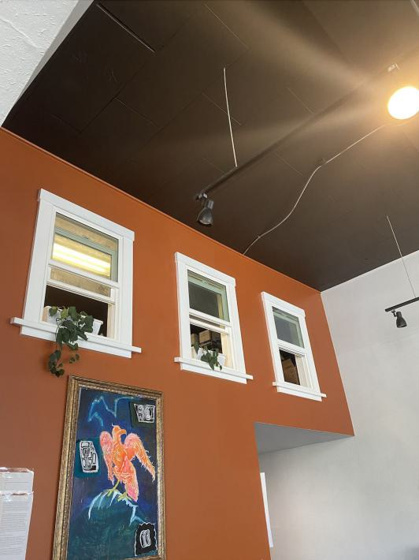
        
 

    

    

        
        
 

    

My living room:

    

        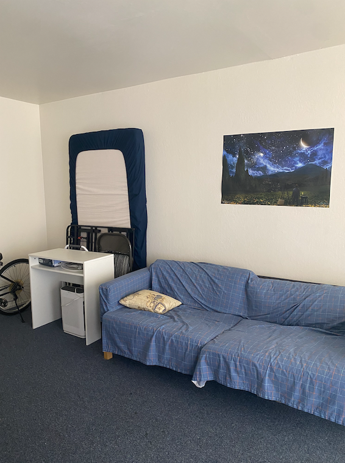
        
 

    

    

        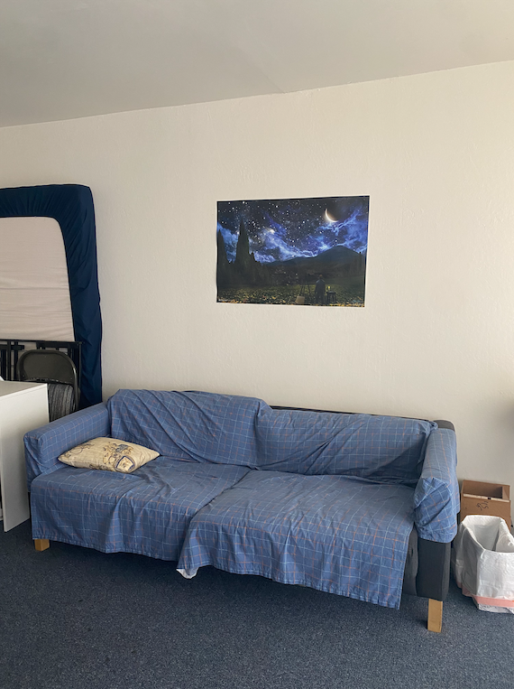
        

    

    

        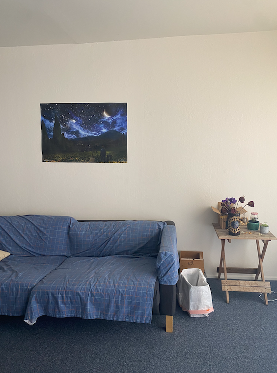
        

    

My kitchen:

    

        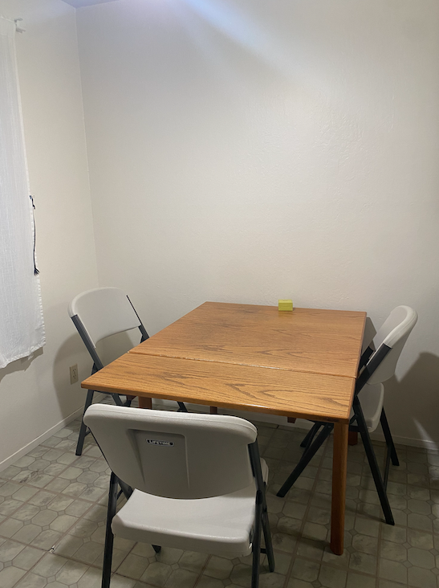
        
 

    

    

        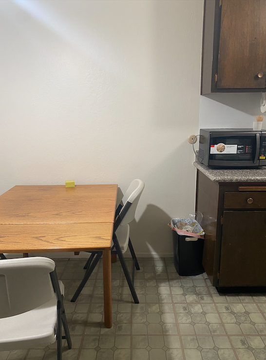
        

    

    

        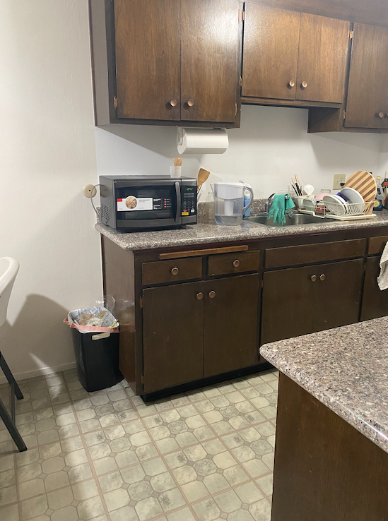
        

    

## Recover Homographies
I defined correspondences in pairs of images. Let's call the points in the source image $(x_i, y_i)$ and the corresponding points in the target image $(x_i', y_i')$. Here are the correspondence points for the photos taken in Souvenir Coffee.

    

        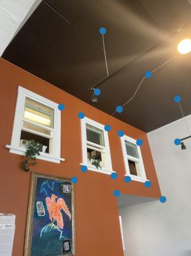
        

    

    

        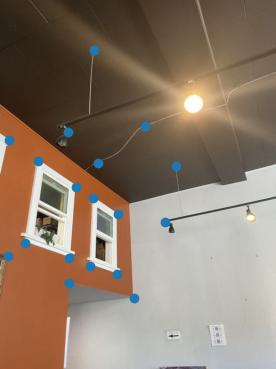
        

    

We want to recover the 3x3 transformation matrix in this equation relating $(x, y)$ to $(x', y')$.

$$
\begin{pmatrix}
a & b & c \\
d & e & f \\
g & h & 1
\end{pmatrix}
\begin{pmatrix}
x \\
y \\
1
\end{pmatrix}
=
\begin{pmatrix}
wx' \\
wy' \\
w
\end{pmatrix}
$$

Expanding the matrix multiplication into a system of equations, we get
$$
ax + by + c = wx' \\
dx + ey + f = wy' \\
gx + hy + 1 = w
$$

Grouping the terms with $x'$ and $y'$, we get
$$
ax + by + c = (gx + hy + 1)x' \\
dx + ey + f = (gx + hy + 1)y'
$$

We can then isolate $x'$ and $y'$:
$$
ax + by + c - gx'x - hy'x' = x' \\
dx + ey + f - gx'y' - hy'y' = y'
$$

This gives the matrix equation:
$$
\begin{pmatrix}
x & y & 1 & 0 & 0 & 0 & -xx' & -yx' \\
0 & 0 & 0 & x & y & 1 & -xy' & -yy'
\end{pmatrix}
\begin{pmatrix}
a \\
b \\
c \\
d \\
e \\
f \\
g \\
h
\end{pmatrix}
=
\begin{pmatrix}
x' \\
y'
\end{pmatrix}
$$

We can create this matrix equation for all of the $(x_i, y_i)$ and corresponding $(x_i', y_i')$. We can then stack all of these equations together (in matrix form) to form an overconstrained system of equations that we can approximately solve using least squares. We get a length 8 vector as the solution, and we can then stack a 1 at the bottom and then reshape this into a 3x3 matrix. We call this matrix our homography H.

## Warp Images
I computed the homography matrix H according to the previous part, and I warped my source image towards the target image using the homography. This transforms the source image's points such that they align with the corresponding points in the target image. For this part, I dynamically calculated the size of the bounding box of the new image based on the image warp.

## Rectify Images
With the image warping function, we can "rectify" images that have a known rectangle in them, even if the rectangle is not directly facing the camera in the initial photo. We can choose four corners of the rectangle in the image, and we can then compute a homography between that rectangle's points and an actual rectangle with points that we define ourselves (e.g. `[(200, 200), (300, 200), (300, 400), (200, 400)]`). This warps the image so that the rectangle in the image is now facing the camera.

    
Original image with rectification points

    
Warped image

    

        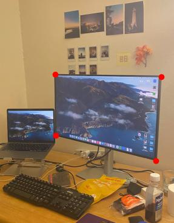
        

    

    

        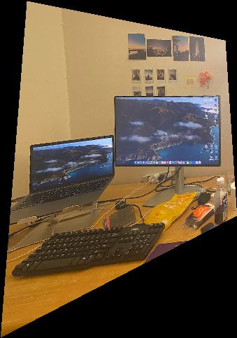
        

    

    

        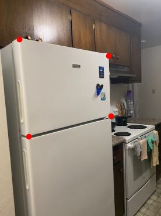
        

    

    

        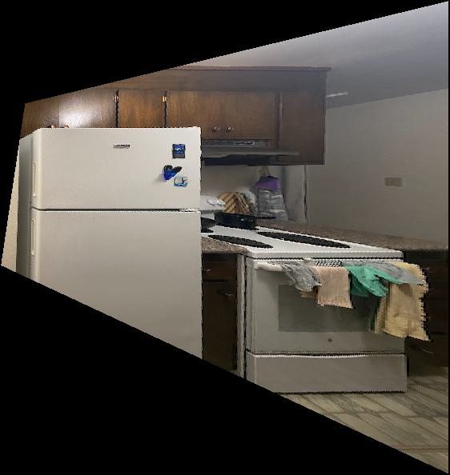
        

    

## Blend Images into a Mosaic
I created a caricature of my face by calculating extrapolated correspondence points and warping my face to the triangulation formed by those points. I computed `p + 1.4(q - p)` for the extrapolated correspondence points, where `p` denotes the correspondence points on my face and `q` denotes the correspondence points on the mean face of the FEI dataset.

    

        
        
My caricature using mean neutral face

    

    

        
        
My caricature using mean smiling face

    

The top left of my face at the hairline has some artifacts. This is likely because the point labeling on the FEI dataset does not have any points on the forehead or hairline, so it is not warped as cleanly as the rest of the face.

## Bells and Whistles: Principal Component Analysis
I took each `m x n` image and represented it as a vector of length `m * n` (for the FEI dataset, this was `300 * 250`). The entire dataset can then be represented as a `k x (m * n)` matrix, where `k` is the number of images in the dataset. I performed PCA on this matrix using `sklearn.decomposition.PCA` to obtain the eigenfaces for the FEI dataset.

Here are the eigenfaces in order of decreasing eigenvalue for the neutral and smiling faces.

    

        
        
Neutral eigenfaces

    

    

        
        
Smiling eigenfaces

    

I used the eigenface basis to generate some new face images. I multiplied each of the first 32 eigenfaces by a random weight in the range `(-1, 1)` and normalized the result to obtain a new face.

Here are some newly generated neutral faces.

    

        
        

    

    

        
        

    

    

        
        

    

Some of the results were pretty discolored due to the random weights that were chosen. Here are some randomly generated neutral faces that don't look as good.

    

        
        

    

    

        
        

    

    

        
        

    

Here are some newly generated smiling faces.

    

        
        

    

    

        
        

    

    

        
        

    

In these images, we can see that the mouth area is a bit blurry. I think this is because the smiling faces have more variation in where the mouth is compared to the neutral faces, so the first 32 components of the PCA basis are unable to capture this information as accurately for the smiling faces. Otherwise, the images look fairly realistic.
