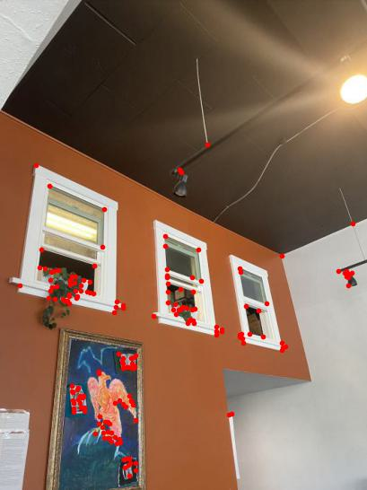
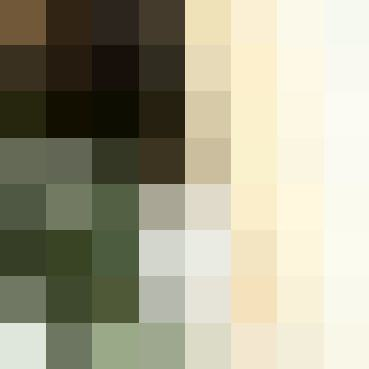

# Project 4: (Auto)Stitching Photo Mosaics
# Project 4A: Image Warping and Mosaicing

## Shoot Pictures
For the mosaics, I took pictures in Souvenir Coffee on College Avenue, in my living room, and in my kitchen. I shot these with my iPhone 11 Pro.

Souvenir Coffee:

    

        
        
 

    

    

        
        
 

    

My living room:

    

        
        
 

    

    

        
        

    

    

        
        

    

My kitchen:

    

        
        
 

    

    

        
        

    

    

        
        

    

## Recover Homographies
I defined correspondences in pairs of images. Let's call the points in the source image $$(x_i, y_i)$$ and the corresponding points in the target image $$(x_i', y_i')$$. Here are the correspondence points for the photos taken in Souvenir Coffee.

    

        
        

    

    

        
        

    

We want to recover the 3x3 transformation matrix in this equation relating $$(x, y)$$ to $$(x', y')$$.

$$
\begin{bmatrix}
a & b & c \\
d & e & f \\
g & h & 1
\end{bmatrix}
\begin{bmatrix}
x \\
y \\
1
\end{bmatrix}
=
\begin{bmatrix}
wx' \\
wy' \\
w6
\end{bmatrix}
$$

Expanding the matrix multiplication into a system of equations, we get

$$
ax + by + c = wx' \\
dx + ey + f = wy' \\
gx + hy + 1 = w
$$

We can use the last equation here as an expression for $$w$$. Substituting this into the first two equations, we get

$$
ax + by + c = (gx + hy + 1)x' \\
dx + ey + f = (gx + hy + 1)y'
$$

We can rewrite this so that we have $$x'$$ and $$y'$$ by themselves on the RHS of the equation:

$$
ax + by + c - gx'x - hy'x' = x' \\
dx + ey + f - gx'y' - hy'y' = y'
$$

This gives the matrix equation:

$$
\begin{bmatrix}
x & y & 1 & 0 & 0 & 0 & -xx' & -yx' \\
0 & 0 & 0 & x & y & 1 & -xy' & -yy'
\end{bmatrix}
\begin{bmatrix}
a \\
b \\
c \\
d \\
e \\
f \\
g \\
h
\end{bmatrix}
=
\begin{bmatrix}
x' \\
y'
\end{bmatrix}
$$

We can create this matrix equation for all of the $$(x_i, y_i)$$ and corresponding $$(x_i', y_i')$$. We can then stack all of these equations together (in matrix form) to form an overconstrained system of equations that we can approximately solve using least squares. We get a length 8 vector as the solution. We can append a 1 to the bottom of this vector and then reshape this into a 3x3 matrix. We call this matrix our homography `H`.

## Warp Images
I used the following procedure to warp one image towards another:

1. Compute the homography matrix `H` from the source image to the target image according to the procedure in the previous part.
2. Get the four corners of the source image and stack them row-by-row into a matrix of homogeneous coordinates. In other words, convert the four corners' points from `(x, y)` to `(x, y, 1)` and stack them into a 4x3 matrix. Let's call this matrix `src_bounds`.
3. Warp the bounding box of the image by doing a matrix multiplication `trg_bounds = src_bounds @ H.T`.
4. Use `skimage.draw.polygon` to get the points in the quadrilateral bounded by the warped four corners. Make sure that the coordinates passed into the `polygon` function are all positive, and calculate the output shape of the warped image using the minimum and maximum of the warped image corners. Let's call these points in the quadrilateral `pixel_coords`.
5. Find each point in the original image corresponding to each warped pixel by calculating `pixel_coords @ np.linalg.inv(H).T`, making use of the inverse transform. Use `scipy.interpolate.griddata` to interpolate pixel values in the warped image.

This warp transforms the source image's points to make them aligned with the corresponding points in the target image.

## Rectify Images
With the image warping function, we can "rectify" images that have a known rectangle in them, even if the rectangle is not directly facing the camera in the initial photo. We can choose four corners of the rectangle in the image as the source points, and we can create an actual rectangle with points that we define ourselves (e.g. `[(200, 200), (300, 200), (300, 400), (200, 400)]`) as the target points. Then, we can compute a homography between our source rectangle points in the image and our actual target rectangle. This warps the image so that the rectangle in the image is now facing the camera.

    
Original image with rectification points

    
Warped image

    

        
        

    

    

        
        

    

    

        
        

    

    

        
        

    

The desk image may look a bit odd, but notice how all the pictures behind the monitor have been warped so that they are more rectangular. The laptop is at an angle compared to the monitor and looks stretched out in the warped image, which is expected because we chose the monitor's screen as the rectification points. If you consider only the monitor, keyboard, and pictures on the wall in the back, the rectification is more clear.

## Blend Images into a Mosaic
To create a mosaic, I chose one image to be the reference image, and warped the other images towards the reference image by computing homographies between each image and the reference image. Specifically, I padded the reference image to a certain fixed size, adjusted the correspondence points labeled on the reference image accordingly, and warped the other images to this new padded image while making sure to keep the same image shape after the warp. This allowed the entire mosaic to fit on one larger canvas. I created mosaics of two and three images.

To blend the images together in the mosaic, I used two-band blending with a distance transform mask. I used the following procedure to blend two images together:

1. Compute the distance transform mask for both images. The distance transform sets each pixel inside a region (in this case, the image's bounding box) to be the Euclidean distance to the nearest edge. The final mask is normalized between 0 and 1. See images below for examples. Let's call the masks `mask1` and `mask2` for the first and second image respectively.
2. Find the low frequencies and high frequencies of each image. I obtained the low frequencies by blurring the image with a Gaussian filter of kernel size 7 and sigma 2, and I obtained the high frequencies by subtracting the low frequencies from the original image. I used my code from project 2 for the blurring. Let's call the low and high frequencies for the first image `low1` and `high1`, and similarly `low2` and `high2` for the second image.
3. Combine the low frequencies of the two images using a weighted average, where the weights are the images' respective masks. I calculated this using `(low1 * mask1 + low2 * mask2) / (mask1 + mask2)`, where the division ensured that the weights summed to 1 everywhere that either of the masks were nonzero. If both of the masks were 0 at a certain pixel, then I just set that pixel to 0 (avoiding zero division error) since neither image was present at that pixel.
4. Combine the high frequencies by taking `high1` where `mask1` is greater than `mask2`, and `high2` otherwise.
5. Add the low frequency blend to the high frequency blend to get the final mosaic.

Here are the distance transforms for the warped/padded Souvenir Coffee photos.

    
Image

    
Distance transform

    

        
        

    

    

        
        

    

    

        
        

    

    

        
        

    

We can then blend these images into a mosaic using the procedure outlined above.

    

        
        
Mosaic before blending

    

    

        
        
Mosaic after blending

    

The seam between the images in the ceiling is much more smooth after the blend, especially near the light.

I repeated this process on photos taken in my living room and my kitchen.

Living room:

    

        
        
 

    

    

        
        

    

    

        
        

    

    

        
        
Mosaic before blending

    

    

        
        
Mosaic after blending

    

Kitchen:

    

        
        
 

    

    

        
        

    

    

        
        

    

    

        
        
Mosaic before blending

    

    

        
        
Mosaic after blending

    

In the kitchen mosaic, there is an increase in brightness from the leftmost image to the middle image to the rightmost image. This difference in lighting is already there in the original kitchen photos — compare the color of the chairs in the left two images, and the color of the floor tiles in the right two images. Some finer details in the living room mosaic and kitchen mosaic are off by a few pixels, but I attribute this to imperfections in my manual labeling of correspondence points as opposed to issues with my warping or blending procedures. This is something that we will improve upon in Part B when we automatically choose correspondence points for stitching images together.

# Project 4B: Feature Matching for Autostitching

## Harris Interest Point Detector
I used the provided code `harris.py` to find the Harris corners in my images. For these images below, I used the code with `num_peaks = 200` in the `peak_local_max` function in the `get_harris_corners` function, so that it would generate at most 200 peaks. The Harris Interest Point Detector finds peaks in the matrix (see right image below) as the "corners" of the image.

    

        
        
Souvenir Coffee image with labeled Harris points

    

    

        
        
Harris matrix

    

## Adaptive Non-Maximal Suppression (ANMS)
In the Harris interest points above, we can see that many of the points are clustered around areas where there are lots of detail in the image, such as on the plants in the windows and around the bird's feet in the painting. This means we have a lot of redundant information from the Harris points, since the points get concentrated in certain areas without considering other parts of the image as heavily.

Adaptive non-maximal suppression (ANMS) helps mitigate this issue. In the ANMS procedure, interest points are suppressed based on their corner strength, and only those that are a maximum in a certain radius of pixels are kept (Brown et al.). I implemented this procedure as follows:

1. Create an array `scores` that contains the strength value of each Harris corner. Assuming we have the result `h, coords = get_harris_corners(im1)`, we can create `scores = h[coords[0, :], coords[1, :]]`.
2. Determine if `f(x_i) < c_robust * f(x_j)` for each pair of corners (this is from the Brown et al paper). Here, `f(x_i)` refers to the corner strength of an interest point `x_i`. I did this comparison using numpy broadcasting: `larger_mask = scores[:, np.newaxis] < (c_robust * scores[np.newaxis, :])`. Appending a new axis to different dimensions of the `scores` array allows this operation to be done pairwise between elements of the `scores` array.
3. Compute pairwise distances between Harris corners `dists = dist2(coords.T, coords.T)` where `dist2` is the function given in `harris.py`.
4. Mask the distances using `masked_dists = dists * larger_mask` so that we only keep pairs of corners that satisfy the inequality in step 2. Set the zeroed-out elements to infinity in `masked_dists` because we want to do a minimum operation in the next step, and we want to ignore the masked out elements.
5. What's left now is to compute the minimum suppression radius $$r_i = \min_j \left\vert x_i - x_j \right\vert$$ such that the inequality from step 2 is true for all `x_j`. Qualitatively, this means that the minimum suppression radius is determined by the nearest neighbor `x_j` such that `c_robust * f(x_j) > f(x_i)`. To code this, I obtained the minimum radius for each point using `radii = np.min(masked_dists, axis=1)`, and then got the indices of `radii` sorted in decreasing order by `sorted_indices = (-radii).argsort()`.
6. Get the resulting corners by indexing into `coords` (coordinates of our Harris corners) using `sorted_indices`: `sorted_corners = coords.T[sorted_indices]`. Get the desired number of ANMS points by splicing this list using `points = sorted_corners[:num_anms_pts]`.

Here is the Souvenir Coffee image from above after the ANMS procedure.

    

        
        
Top 16 ANMS points

    

    

        
        
Top 24 ANMS points

    

    

        
        
Top 32 ANMS points

    

    

        
        
Top 64 ANMS points

    

The rest of the project is done using the top 64 ANMS points.

## Feature Descriptor Extraction
For each point obtained from ANMS, I used the following procedure:

1. Extract a 40x40 patch centered around the point.
2. Resize this patch to 8x8 using `skimage.transform.resize` and normalized it to a `(0, 1)` range using `sk.exposure.rescale_intensity`
3. Flatten the patch to a `(1, 8*8*3)` vector.

Each of these vectors is a feature descriptor of the image. I stacked these vectors from all ANMS points into a `features` matrix of shape `(num_anms_points, 8*8*3)`. I did this for each image in the mosaic I was creating, so I ended up with 2 or 3 `features` matrices (depending on whether my mosaic was using 2 or 3 images).

Here are all 64 feature descriptors, without normalization, from the Souvenir Coffee image.

    

        
        

    

## Feature Matching
To match features between two images whose feature matrices were named `features1` and `features2`, I used the following procedure:

1. Compute pairwise differences between each `(1, 8*8*3)` feature descriptor using `pairwise_diff = features1[:, np.newaxis, :] - features2[np.newaxis, :, :]`, again making use of numpy broadcasting.
2. Calculate the sum of squared differences between each pair of features using `ssd = np.sum(pairwise_diff ** 2, axis=-1)`.
3. Sort the `ssd` array within each row in ascending order, where each row represents a feature descriptor from the first image, so that the first element in the row is the feature's "nearest neighbor" in terms of feature similarity. We can do this using `sorted_ssd = np.sort(ssd)`.
4. Find the Lowe score for each feature by dividing the distance to its nearest neighbor by the distance to its second nearest neighbor. Since we sorted `ssd` within each row in ascending order, we can get the Lowe score for all features by doing `lowe = sorted_ssd[:, 0] / sorted_ssd[:, 1]`.
5. Extract the features with Lowe score less than the Lowe threshold by `lowe_mask = lowe < lowe_threshold`. I used `lowe_threshold = 0.3`. The idea behind the Lowe score is that if a feature is a true match with another feature, then its nearest neighbor distance (to the correct matching feature) should be much smaller than its second nearest neighbor distance (to an incorrect match).
6. Get the indices of the nearest neighbor for each feature (so these are the features of image 2) using `sorted_ssd_idx = ssd.argsort()` and then `closest = sorted_ssd_idx[:, 0]`, since the item with the lowest SSD value of each row will be the first element of each row in `sorted_ssd_idx`.
7. Pair these nearest neighbor indices with the corresponding features in the image 1 using `matches = np.stack([np.arange(0, closest.shape[0]), closest]).T`, since the features of the image 1 are ordered accordingly in its rows and their indices are given by `np.arange(0, closest.shape[0])`. `matches` is then an array of dimension `(num_anms_points, 2)`, with its first column as `np.arange(0, num_anms_points)` and second column as indices for `features2`, such that each row of `matches` corresponds to a pair of indices in `features1` and `features2` where the second feature is the nearest neighbor of the first feature.
8. Extract the final feature matches using `matches[lowe_mask]` to ensure that all the matches lie within the Lowe threshold.

Using `lowe_threshold = 0.3` and `num_anms_pts = 64` (from the ANMS section) gives around 13-17 feature matches, depending on the images. Here are some examples of feature matches between the two Souvenir Coffee images.

    
Souvenir image 1

    
Souvenir image 2

    
Souvenir image 1

    
Souvenir image 2

    

        
        

    

    

        
        

    

    

        
        

    

    

        
        

    

    

        
        

    

    

        
        

    

    

        
        

    

    

        
        

    

    

        
        

    

    

        
        

    

    

        
        

    

    

        
        

    

Here are the feature matches between my two Souvenir images.

    

        
        

    

    

        
        

    

## Random Sample Consensus (RANSAC)
To implement RANSAC, I used the following procedure:

1. Split up the `matches` from Feature Matching into `matches1` and `matches2`, where `matches1` denotes the coordinate points that correspond to the first image's feature matches, and similarly for `matches2` and the second image.
2. Randomly select four feature matches using `rnd_idx = np.random.choice(matches1.shape[0], 4, replace=False)`, then `corr1 = matches1[rnd_idx]` and `corr2 = matches2[rnd_idx]`.
3. Compute the exact homography matrix between `corr1` and `corr2` (not using least squares).
4. Convert each row in `matches1` from `(x, y)` to `(x, y, 1)`, and call this resulting array `points1_homogeneous`. Apply the transformation to go from `matches1` to `matches2` using `points1_transformed = points1_homogeneous @ H.T`. Divide the first two columns of `points1_transformed` by the last column to "undo" the change into homogeneous coordinates.
5. Calculate the Euclidean distance between each pair of points in `dist = points1_transformed` and `matches2` using `np.sqrt(np.sum((matches2 - points1_transformed)**2, axis=1))`. We say that an inlier has a Euclidean distance less than some `inlier_thresh`, so we compute a mask `inlier_mask = dist < inlier_thresh`. The number of inliers is then the number of "true" entries in this mask, so we get `num_inliers = np.sum(mask)`.
6. Repeat steps 2-3 `num_iter` times, and keep track of the highest number of inliers from all transformations as well as the `inlier_mask` that corresponds to this, which we call `ransac_mask`.
7. Get the final feature matches using `pts1 = matches1[ransac_mask]` and `pts2 = matches2[ransac_mask]`. Then, do the procedure from Project 4A to warp and blend images into a mosaic using `pts1` and `pts2` as the correspondence points for the two images.

I used `num_iter = 1000` and `inlier_thresh = 0.8`. Here are the final RANSAC matches between my two Souvenir images.

Here are the feature matches between my two Souvenir images.

    

        
        

    

    

        
        

    

Here are images of mosaics using manually labeled correspondences and mosaics using autostitching.

    

        
        
Souvenir with manual correspondence labeling

    

    

        
        
Souvenir with autostitching

    

    

        
        
Living room with manual correspondence labeling

    

    

        
        
Living room with autostitching

    

    

        
        
Kitchen with manual correspondence labeling

    

    

        
        
Kitchen with autostitching

    

We can see that the autostitching makes the mosaics look better. There are some details in the mosaics with manually labeled correspondences that aren't exactly aligned, such as the line on the kitchen table and the line near the top left of the mattress in the living room. The autostitching procedure eliminates human error from the correspondence labeling process, which helps the mosaics turn out much cleaner because I likely had some imperfections in getting the exact pixels to match when I was labeling correspondences manually.

## Reflection
In Project 4A, it was really cool to see all my work come together when I got the blending to work for my mosaics. It felt like everything in this class was coming together, since we had to do alignment, blurring, low pass / high pass, blending, and warping. I learned more about the warping process and was able to try many different blending methods before finding one that worked well, which gave me some more experience into figuring out how to blend images.

In project 4B, I liked seeing how autostitching was able to improve the quality of my mosaics. Autostitching definitely feels both more efficient and less error-prone than manually labeling correspondences. I learned about the RANSAC process in more depth, and I particularly enjoyed learning about how we can use `distance to nearest neighbor / distance to second nearest neighbor` as a metric for feature matching. I thought that was a really neat bit of logic in figuring out whether a feature was a match or not.
