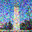

# Project 5: Fun With Diffusion Models
# Project 5A: The Power of Diffusion Models

## Part 0: Setup
In this part, we used the DeepFloyd IF diffusion model, which is a two-stage model trained by Stability AI. We also used precomputed text embeddings to generate images. We used seed 88 for all parts.

We loaded stage 1 and stage 2 of the DeepFloyd model separately and generated images with each.

    <!-- Empty top-left cell -->
    

    <!-- Column Labels -->
    
a man wearing a hat

    
a rocket ship

    
an oil painting of a snowy mountain village

    
Stage 1   num_inference_steps=20

    

        
        
 

    

    

        
        
 

    

    

        
        
 

    

    
Stage 1  num_inference_steps=40

    

        
        
 

    

    

        
        
 

    

    

        
        
 

    

    
Stage 2  num_inference_steps=20

    

        
        
 

    

    

        
        
 

    

    

        
        
 

    

    
Stage 2  num_inference_steps=40

    

        
        
 

    

    

        
        
 

    

    

        
        
 

    

    
Stage 2  num_inference_steps=80

    

        
        
 

    

    

        
        
 

    

    

        
        
 

    

## Part 1.1: Implementing the Forward Process
We implemented the forward diffusion process in `forward(im, t)`, defined by 

$$
q(x_t \mid x_0) &= \mathcal{N}(x_t; \sqrt{\bar{\alpha}_t} x_0, (1 - \bar{\alpha}_t)I) \\
x_t &= \sqrt{\bar{\alpha}_t} x_0 + \sqrt{1 - \bar{\alpha}_t} \, \epsilon, \quad \epsilon \sim \mathcal{N}(0, 1)
$$

$$
ax + by + c = wx' \\
dx + ey + f = wy' \\
gx + hy + 1 = w
$$

We were given the $$\bar{\alpha}_t$$ values for each $$t$$, where $$\bar{\alpha}_t$$ is close to 1 for small $$t$$ (clean image) and close to 0 for large $$t$$ (pure noise). We ran the forward process for `t = 250, 500, 700`.

    

        
        
Campanile

    

    

        
        
Noisy Campanile at t=250

    

    

        
        
Noisy Campanile at t=500

    

    

        
        
Noisy Campanile at t=750

    

## Part 1.2: Classical Denoising
I used a Gaussian blur of kernel size 7 and sigma 2 to try to denoise these images classically.

    

        
        
Noisy Campanile at t=250

    

    

        
        
Noisy Campanile at t=500

    

    

        
        
Noisy Campanile at t=750

    

    

        
        
Gaussian blur denoising at t=250

    

    

        
        
Gaussian blur denoising at t=500

    

    

        
        
Gaussian blur denoising at t=750

    

## Part 1.3: One-Step Denoising
We used the DeepFloyd stage 1 UNet to denoise the image by estimating the noise in the image and then removing it. We got the estimate of the clean image by rearranging the equation above to be an expression for $$x_0$$ in terms of $$x_t$$ (the noised image) and $$\epsilon$$ (the estimated noise from the UNet output).

    

    

        
        
Original Campanile

    

    

    

        
        
Noisy Campanile at t=250

    

    

        
        
Noisy Campanile at t=500

    

    

        
        
Noisy Campanile at t=750

    

    

        
        
One-step denoising at t=250

    

    

        
        
One-step denoising at t=500

    

    

        
        
One-step denoising at t=750

    

## Part 1.4: Iterative Denoising
The results were much better with one-step denoising compared to classical denoising, but the still performance degraded as more noise was added to the image. We used iterative denoising to address this issue. We created a list `strided_timesteps` of monotonically decreasing timesteps, starting at 990 and ending at 0 in 30 step increments. Thus, `strided_timesteps[0]` corresponded to pure noise, and `strided_timesteps[-1]` to the clean image. On the `i`th denoising step at `t = strided_timesteps[i]`, we get to `t' = strided_timesteps[i+1]` (slightly less noisy) using the following formula:

$$
x_{t'} = \frac{\sqrt{\bar{\alpha}_{t'} \beta_t}}{1 - \bar{\alpha}_t} x_0 + \frac{\sqrt{\alpha_t (1 - \bar{\alpha}_{t'})}}{1 - \bar{\alpha}_t} x_t + v_\sigma
$$

The variables are defined in the spec. $$v_\sigma$$ is random noise that we add via `add_variance`, defined for us in the starter code. We implemented the function `iterative_denoise(image, i_start)`, where `image` is a noisy image and `i_start` is the index at which we start at in `strided_timesteps` (i.e. how noised the image is). We added noise to the image using `t=strided_timesteps[10]` and then ran `iterative_denoise` on the image using `i_start=0` for the results below.

    

        
        
Noisy Campanile at t=90

    

    

        
        
Noisy Campanile at t=240

    

    

        
        
Noisy Campanile at t=390

    

    

        
        
Noisy Campanile at t=540

    

    

        
        
Noisy Campanile at t=690

    

    

        
        
Original Campanile

    

    

        
        
Iteratively denoised Campanile

    

    

        
        
One-step denoised Campanile

    

    

        
        
Gaussian blurred Campanile

    

## Part 1.5: Diffusion Model Sampling
Now, we can generate images from scratch by setting `i_start=0` in the call to `iterative_denoise` and passing in pure noise. This effectively denoises pure noise to create a new image. We did this on the prompt "a high quality photo". Here are 5 sampled images.

    

        
        

    

    

        
        

    

    

        
        

    

    

        
        

    

    

        
        

    

## Part 1.6: Classifier-Free Guidance (CFG)
To further improve performance, we implemented classifier-free guidance. In CFG, we compute both a conditional and unconditional noise estimate, which are denoted $$\epsilon_c$$ and $$\epsilon_u$$ respectively. The new noise estimate using CFG is then

$$
\epsilon = \epsilon_u + \gamma (\epsilon_c - \epsilon_u)
$$

We use $$\gamma = 7$$, and we use an empty prompt `""` for unconditional guidance.

Here are images generated using CFG.

    

        
        

    

    

        
        

    

    

        
        

    

    

        
        

    

    

        
        

    

## Part 1.7: Image-to-image Translation
To make edits to existing images, we can take a real image, add noise to it, and then denoise it, following the SDEdit algorithm. The more noise we add, the more the model can be "creative" and generate something new (not in the original image). We use the noise levels `[1, 3, 5, 7, 10, 20]`, so we add noise using `forward(im, strided_timesteps[i_start])` and we denoise by passing in the appropriate `i_start` to `iterative_denoise_cfg`.

I did this process on the Campanile image, as well as images of a dog and a tree.

    

        
        
SDEdit with i_start=1

    

    

        
        
SDEdit with i_start=3

    

    

        
        
SDEdit with i_start=5

    

    

        
        
SDEdit with i_start=7

    

    

        
        
SDEdit with i_start=10

    

    

        
        
SDEdit with i_start=20

    

    

        
        
Campanile

    

    

        
        
SDEdit with i_start=1

    

    

        
        
SDEdit with i_start=3

    

    

        
        
SDEdit with i_start=5

    

    

        
        
SDEdit with i_start=7

    

    

        
        
SDEdit with i_start=10

    

    

        
        
SDEdit with i_start=20

    

    

        
        
Dog

    

    

        
        
SDEdit with i_start=1

    

    

        
        
SDEdit with i_start=3

    

    

        
        
SDEdit with i_start=5

    

    

        
        
SDEdit with i_start=7

    

    

        
        
SDEdit with i_start=10

    

    

        
        
SDEdit with i_start=20

    

    

        
        
Tree

    

## Part 1.7.1: Editing Hand-Drawn and Web Images
We experimented with hand-drawn and other non-realistic images using our diffusion model. We followed the same process as described above, using noise levels `[1, 3, 5, 7, 10, 20]` to noise and denoise images.

I did this on an image of tree clip art, as well as my hand-drawn images of an apple and the sky. The yellow-ish circle in the sky image is supposed to be the Sun, although I don't think it came across very well after the code compressed my hand-drawn image.

    

        
        
SDEdit with i_start=1

    

    

        
        
SDEdit with i_start=3

    

    

        
        
SDEdit with i_start=5

    

    

        
        
SDEdit with i_start=7

    

    

        
        
SDEdit with i_start=10

    

    

        
        
SDEdit with i_start=20

    

    

        
        
Tree Clip Art

    

    div style="text-align: center;">
        
        
SDEdit with i_start=1

    

    

        
        
SDEdit with i_start=3

    

    

        
        
SDEdit with i_start=5

    

    

        
        
SDEdit with i_start=7

    

    

        
        
SDEdit with i_start=10

    

    

        
        
SDEdit with i_start=20

    

    

        
        
Hand-Drawn Apple

    

    div style="text-align: center;">
        
        
SDEdit with i_start=1

    

    

        
        
SDEdit with i_start=3

    

    

        
        
SDEdit with i_start=5

    

    

        
        
SDEdit with i_start=7

    

    

        
        
SDEdit with i_start=10

    

    

        
        
SDEdit with i_start=20

    

    

        
        
Hand-Drawn Sky

    

## Part 1.7.2: Inpainting
I used the provided code `harris.py` to find the Harris corners in my images. For these images below, I used the code with `num_peaks = 200` in the `peak_local_max` function in the `get_harris_corners` function, so that it would generate at most 200 peaks. The Harris Interest Point Detector finds peaks in the matrix (see right image below) as the "corners" of the image.

    

        
        
Souvenir Coffee image with labeled Harris points

    

    

        
        
Harris matrix

    

## Adaptive Non-Maximal Suppression (ANMS)
In the Harris interest points above, we can see that many of the points are clustered around areas where there are lots of detail in the image, such as on the plants in the windows and around the bird's feet in the painting. This means we have a lot of redundant information from the Harris points, since the points get concentrated in certain areas without considering other parts of the image as heavily.

Adaptive non-maximal suppression (ANMS) helps mitigate this issue. In the ANMS procedure, interest points are suppressed based on their corner strength, and only those that are a maximum in a certain radius of pixels are kept (Brown et al.). I implemented this procedure as follows:

1. Create an array `scores` that contains the strength value of each Harris corner. Assuming we have the result `h, coords = get_harris_corners(im1)`, we can create `scores = h[coords[0, :], coords[1, :]]`.
2. Determine if `f(x_i) < c_robust * f(x_j)` for each pair of corners (this is from the Brown et al paper). Here, `f(x_i)` refers to the corner strength of an interest point `x_i`. I did this comparison using numpy broadcasting: `larger_mask = scores[:, np.newaxis] < (c_robust * scores[np.newaxis, :])`. Appending a new axis to different dimensions of the `scores` array allows this operation to be done pairwise between elements of the `scores` array.
3. Compute pairwise distances between Harris corners `dists = dist2(coords.T, coords.T)` where `dist2` is the function given in `harris.py`.
4. Mask the distances using `masked_dists = dists * larger_mask` so that we only keep pairs of corners that satisfy the inequality in step 2. Set the zeroed-out elements to infinity in `masked_dists` because we want to do a minimum operation in the next step, and we want to ignore the masked out elements.
5. What's left now is to compute the minimum suppression radius $$r_i = \min_j \left\vert x_i - x_j \right\vert$$ such that the inequality from step 2 is true for all `x_j`. Qualitatively, this means that the minimum suppression radius is determined by the nearest neighbor `x_j` such that `c_robust * f(x_j) > f(x_i)`. To code this, I obtained the minimum radius for each point using `radii = np.min(masked_dists, axis=1)`, and then got the indices of `radii` sorted in decreasing order by `sorted_indices = (-radii).argsort()`.
6. Get the resulting corners by indexing into `coords` (coordinates of our Harris corners) using `sorted_indices`: `sorted_corners = coords.T[sorted_indices]`. Get the desired number of ANMS points by splicing this list using `points = sorted_corners[:num_anms_pts]`.

Here is the Souvenir Coffee image from above after the ANMS procedure.

    

        
        
Top 16 ANMS points

    

    

        
        
Top 24 ANMS points

    

    

        
        
Top 32 ANMS points

    

    

        
        
Top 64 ANMS points

    

The rest of the project is done using the top 64 ANMS points.

## Feature Descriptor Extraction
For each point obtained from ANMS, I used the following procedure:

1. Extract a 40x40 patch centered around the point.
2. Resize this patch to 8x8 using `skimage.transform.resize` and normalized it to a `(0, 1)` range using `sk.exposure.rescale_intensity`.
3. Flatten the patch to a `(1, 8*8*3)` vector.

Each of these vectors is a feature descriptor of the image. I stacked these vectors from all ANMS points into a `features` matrix of shape `(num_anms_points, 8*8*3)`. I did this for each image in the mosaic I was creating, so I ended up with 2 or 3 `features` matrices (depending on whether my mosaic was using 2 or 3 images).

Here are all 64 feature descriptors, without normalization, from the Souvenir Coffee image.

    

        
        

    

## Feature Matching
To match features between two images whose feature matrices were named `features1` and `features2`, I used the following procedure:

1. Compute pairwise differences between each `(1, 8*8*3)` feature descriptor using `pairwise_diff = features1[:, np.newaxis, :] - features2[np.newaxis, :, :]`, again making use of numpy broadcasting.
2. Calculate the sum of squared differences between each pair of features using `ssd = np.sum(pairwise_diff ** 2, axis=-1)`.
3. Sort the `ssd` array within each row in ascending order, where each row represents a feature descriptor from the first image, so that the first element in the row is the feature's "nearest neighbor" in terms of feature similarity. We can do this using `sorted_ssd = np.sort(ssd)`.
4. Find the Lowe score for each feature by dividing the distance to its nearest neighbor by the distance to its second nearest neighbor. Since we sorted `ssd` within each row in ascending order, we can get the Lowe score for all features by doing `lowe = sorted_ssd[:, 0] / sorted_ssd[:, 1]`.
5. Extract the features with Lowe score less than the Lowe threshold by `lowe_mask = lowe < lowe_threshold`. I used `lowe_threshold = 0.3`. The idea behind the Lowe score is that if a feature is a true match with another feature, then its nearest neighbor distance (to the correct matching feature) should be much smaller than its second nearest neighbor distance (to an incorrect match).
6. Get the indices of the nearest neighbor for each feature (so these are the features of image 2) using `sorted_ssd_idx = ssd.argsort()` and then `closest = sorted_ssd_idx[:, 0]`, since the item with the lowest SSD value of each row will be the first element of each row in `sorted_ssd_idx`.
7. Pair these nearest neighbor indices with the corresponding features in the image 1 using `matches = np.stack([np.arange(0, closest.shape[0]), closest]).T`, since the features of the image 1 are ordered accordingly in its rows and their indices are given by `np.arange(0, closest.shape[0])`. `matches` is then an array of dimension `(num_anms_points, 2)`, with its first column as `np.arange(0, num_anms_points)` and second column as indices for `features2`, such that each row of `matches` corresponds to a pair of indices in `features1` and `features2` where the second feature is the nearest neighbor of the first feature.
8. Extract the final feature matches using `matches[lowe_mask]` to ensure that all the matches lie within the Lowe threshold.

Using `lowe_threshold = 0.3` and `num_anms_pts = 64` (from the ANMS section) gives around 13-17 feature matches, depending on the images. Here are 6 examples of feature matches between the two Souvenir Coffee images.

    
Souvenir image 1

    
Souvenir image 2

    
Souvenir image 1

    
Souvenir image 2

    

        
        

    

    

        
        

    

    

        
        

    

    

        
        

    

    

        
        

    

    

        
        

    

    

        
        

    

    

        
        

    

    

        
        

    

    

        
        

    

    

        
        

    

    

        
        

    

Here are the feature matches between my two Souvenir images.

    

        
        

    

    

        
        

    

## Random Sample Consensus (RANSAC)
To implement RANSAC for computing a homography, I used the following procedure:

1. Split up the `matches` from Feature Matching into `matches1` and `matches2`, where `matches1` denotes the coordinate points that correspond to the first image's feature matches, and similarly for `matches2` and the second image.
2. Randomly select four feature matches using `rnd_idx = np.random.choice(matches1.shape[0], 4, replace=False)`, then `corr1 = matches1[rnd_idx]` and `corr2 = matches2[rnd_idx]`.
3. Compute the exact homography matrix between `corr1` and `corr2` (not using least squares).
4. Convert each row in `matches1` from `(x, y)` to `(x, y, 1)`, and call this resulting array `points1_homogeneous`. Apply the transformation to go from `matches1` to `matches2` using `points1_transformed = points1_homogeneous @ H.T`. Divide the first two columns of `points1_transformed` by the last column to "undo" the change into homogeneous coordinates.
5. Calculate the Euclidean distance between each pair of points in `dist = points1_transformed` and `matches2` using `np.sqrt(np.sum((matches2 - points1_transformed)**2, axis=1))`. We say that an inlier has a Euclidean distance less than some `inlier_thresh`, so we compute a mask `inlier_mask = dist < inlier_thresh`. The number of inliers is then the number of "true" entries in this mask, so we get `num_inliers = np.sum(mask)`.
6. Repeat steps 2-3 `num_iter` times, and keep track of the highest number of inliers from all transformations as well as the `inlier_mask` that corresponds to this, which we call `ransac_mask`.
7. Get the final correspondence points using all of the inliers from the transformation that has the most inliers. Do this using `pts1 = matches1[ransac_mask]` and `pts2 = matches2[ransac_mask]`. Recompute the homography matrix between `pts1` and `pts2` using least squares for a more robust homography calculation.

Then, do the procedure from Project 4A to warp and blend images into a mosaic using `pts1` and `pts2` as the correspondence points for the two images. 

I used `num_iter = 1000` and `inlier_thresh = 0.8`. Here are the final RANSAC matches between my two Souvenir images.

    

        
        

    

    

        
        

    

Here are images of mosaics using manually labeled correspondences and mosaics using autostitching.

    

        
        
Souvenir with manual correspondence labeling

    

    

        
        
Souvenir with autostitching

    

    

        
        
Living room with manual correspondence labeling

    

    

        
        
Living room with autostitching

    

    

        
        
Kitchen with manual correspondence labeling

    

    

        
        
Kitchen with autostitching

    

We can see that the autostitching makes the mosaics look better. There are some details in the mosaics with manually labeled correspondences that aren't exactly aligned, such as the line on the kitchen table and the line near the top left of the mattress in the living room. The autostitching procedure eliminates human error from the correspondence labeling process, which helps the mosaics turn out cleaner. I likely had some imperfections in getting the exact pixels to match when I was labeling correspondences manually.

## Reflection
In Project 4A, it was really cool to see all my work come together when I got the blending to work for my mosaics. It felt like everything in this class was coming together, since we had to do alignment, blurring, low pass / high pass, blending, and warping. I learned more about the warping process and was able to try many different blending methods before finding one that worked well, which gave me some more experience into figuring out how to blend images.

In project 4B, I liked seeing how autostitching was able to improve the quality of my mosaics. Autostitching definitely feels both more efficient and less error-prone than manually labeling correspondences. I learned about the RANSAC process in more depth, and I particularly enjoyed learning about how we can use `distance to nearest neighbor / distance to second nearest neighbor` as a metric for feature matching. I thought that was a really neat bit of logic in figuring out whether a feature was a match or not.
