# Final Project
I did the Light Field Camera project and the Gradient Domain Fusion project.

I switch between "I" and "we" as well as past and present tense in this website. Sorry!

# Light Field Camera
## Part 1: Depth Refocusing
I used the [Stanford Light Field Archive](http://lightfield.stanford.edu/lfs.html) chess dataset, which contained 289 rectified images that were taken with locations in a 17x17 grid. Each image was of shape `(800, 1400, 3)`. I read in all the images and arranged it into a `np.array` of shape `(17, 17, 800, 1400, 3)`, where the first two dimensions described the location of the image where it was taken.

I used the following procedure to refocus my images:
1. Get the position of the center image in the 17x17 grid, which was `(8, 8)`.
2. For every other image positioned at `(i, j)` in the dataset, calculate the horizontal and vertical distances between that image and the center image by doing `x_dist = j - center[1]` and `y_dist = i - center[0]`.
3. Scale these distances by some depth factor `depth_factor` to produce the shift offsets `x_shift` and `y_shift`, calculated as `x_shift = int(x_dist * depth_factor)` and `y_shift = -int(y_dist * depth_factor)`.
4. Shift the image using `np.roll` with the `x_shift` and `y_shift` from the previous step.
5. After doing steps 2-4 for all images (except for the center image), average all the shifted image results from step 4.

I chose to control the depth refocusing using a linear depth factor rather than the `alpha` term from the paper, since I found a linear factor to be easier to control, simpler, and more understandable/intuitive.

Here are my results using different depth factors.

    

        
        
 

    

    

        
        
 

    

    

        
        
 

    

    

        
        
 

    

Here is a gif showing the refocusing variation from depth factor 0 to depth factor 3. We can see that it looks like the camera is shifting its focus from the back right corner to the front left corner.

    

        
        
 

    

## Part 2: Aperture Adjustment
In the previous part, there was a significant amount of blur on the chessboard for portions of the image that were not in focus. The depth refocusing procedure mimicked a camera with a large aperture because it accounted for images that were at positions relatively far from the center reference image. We can mimic a camera with a smaller aperture by ignoring images that are too far from the center reference image based on some `aperture` parameter.

To emulate taking photos with different camera apertures, I modified the procedure for depth refocusing to only take into account images that were within a certain distance of the center image. I changed the `refocus_depth` method to take in an `aperture` argument. During the iteration through the 17x17 array of images, I added a check to skip images that were more than `aperture` grid positions away from the center position `(8, 8)`. For each image at position `(i, j)`, I checked whether `abs(i - center[0]) > aperture or abs(j - center[1]) > aperture`; if true, I skipped the image and did not use it when calculating the final result.

Here are my result using different `aperture` values. For all images in this part, I used a depth factor of 1.5 to focus on the center of the image.

    

        
        

    

    

        
        

    

    

        
        

    

    

        
        

    

We can indeed see that as the aperture grows larger, the image becomes more blurry around the edges.

Here is a gif showing the aperture variation from `aperture=1` to `aperture=7`.

    

        
        
 

    

## Summary
I thought this project was really interesting! I liked getting to see how we could refocus depth by post-processing images that were taken with locations in a grid, and I also enjoyed visualizing the effect of aperture size on images. I learned about ways that we can refocus depth and mimic different camera apertures just by relatively simple post-processing techniques.

# Gradient Domain Fusion
For the Poisson blending portion of this project, I used the `poly2mask` function from the starter code in UIUC's version of the project [linked here](https://courses.grainger.illinois.edu/cs445/fa2023/projects/gradient/ComputationalPhotography_ProjectGradient.html), which I found while browsing submissions from students in Fall 2023. I only used this one method of the starter code to help generate binary masks for my images, since I did not want to draw my masks manually and I did not use the MATLAB starter code.

## Part 1: Toy Problem
In this part, our goal is to reconstruct the Toy Story image using information from the image's gradients. The idea is that we can think of trying to solve a differential equation, where we can find an exact solution if we match the derivatives at every point and also satisfy an initial condition. In this part, we can reconstruct the Toy Story image (i.e. solve the differential equation) by requiring that all the x-gradients and y-gradients of our new image match the x-gradients and y-gradients of the original image, and also by requiring that the value of the top left corner in the new and original images are the same (this is the initial condition to the differential equation).

If we denote the intensity of the source image at `(x, y)` as `s(x, y)` and the values of the image to solve for as `v(x, y)`, we get the following objectives:
1. Minimize `(v(x+1,y) - v(x,y) - (s(x+1,y) - s(x,y)))^2`, which indicates that the x-gradients of `v` should match the x-gradients of `s`.
2. Minimize `(v(x,y+1) - v(x,y) - (s(x,y+1) - s(x,y)))^2`, which indicates that the y-gradients of `v` should match the y-gradients of `s`.
3. Minimize `(v(0,0) - s(0,0))^2`, which indicates that the top left corners should match in intensity value.

I solved this using least squares optimization `Ax=b` with a sparse matrix, where I solved for `x` as the pixel values of the new image. This was my procedure:
1. Calculate the total number of constraints on the image's pixels as `num_constraints = rows*(cols-1) + (rows-1)*cols + 1`, where `rows` and `cols` are the height and width of the image respectively. The first term is from the x-gradient objective, which is why there is `cols-1` so we prevent index out-of-bounds errors since the objective requires us to do `x+1`. Similarly, the second term is from the y-gradient objective. The `+1` is from the last objective for the initial condition.
2. Initialize a sparse matrix using `A = scipy.sparse.lil_matrix((num_constraints, n_pixels))`, where `n_pixels = rows * cols`. Initialize the least squares `b` vector in `Ax = b` using `b = np.zeros(num_constraints)`. This is because we want each row of `A` to represent a constraint. We also initialize a `counter` variable starting at 0.
3. Iterate through pixels in `rows` and `cols-1` for the x-gradient objective. At pixel `(i, j)`, we set `A[counter, pixel_index(i, j)] = -1` and `A[counter, pixel_index(i, j+1)] = 1`, which matches `v(x+1,y) - v(x,y)` in the objective function. Here, `pixel_index` is a function that returns `i * cols + j` in order to get the index of the pixel in a flat `(n_pixels,)` shape list. Also, set `b[counter] = im[i, j+1] - im[i, j]` to match `s(x+1,y) - s(x,y)` in the objective function. This sets the constraint for the x-gradient for one pixel `(i, j)` because least squares will try to make the gradient calculated by `v(x+1,y) - v(x,y)` match the corresponding value in the `b` vector, which is `s(x+1,y) - s(x,y)`. Then, increment `counter` for the next constraint. Do this for all pixels in `rows` and `cols-1` for the x-gradient objective.
4. Iterate through pixels in `rows-1` and `cols` for the y-gradient objective. Follow the same logic as step 3, except add 1 to `i` instead of `j`.
5. Add the initial condition constraint: `A[counter, pixel_index(0, 0)] = 1` and `b[counter] = im[0, 0]`.
6. Solve using `scipy.sparse.linalg.lsqr(A, b)` and reshape the result `x` to the original image shape.

Here is my result — please ignore the size difference.

    

        
        
Original image

    

    

        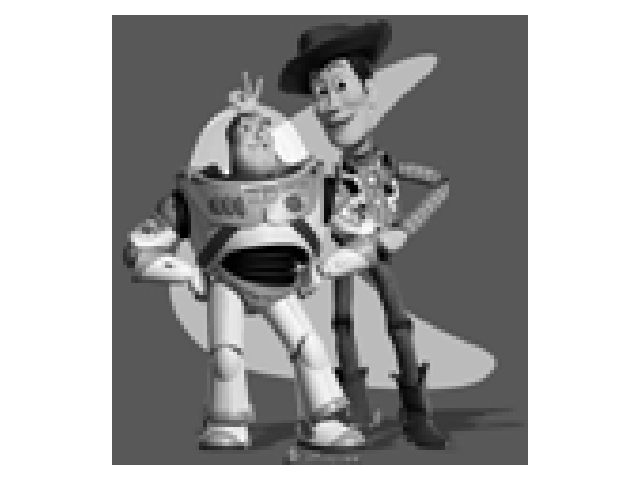
        
Reconstructed image

    

## Part 2: Poisson Blending
We can seamlessly blend images by leveraging the fact that we often notice the gradients of images more than their overall intensity. To blend a source image `s` into a target image `t` as a new blended image `v`, we can write the following objective:

    

        
        
Equation from project spec

    

Here, each `i` is a pixel is the source region `S`, which is the portion of the source image `s` that we want to blend into the target image. Each `j` is a neighboring pixel of `i`, specifically to the left, right, top, and bottom of `i`. The first summation term makes the gradients inside `S` in `v` match the gradients in `s`. The second summation term takes care of the boundary between `S` and the rest of the target image `t` — notice that the summation is over `i` that is in `S` but `j` that is not in `S`, meaning that the pixel `i` is on the boundary of `S`. Because we don't want to modify any pixels in the target image `t` outside of the region `S`, we want to make the pixel `j` in `v` be the same as the pixel `j` in `t`. In other words, this means that the second summation does the same thing as the first summation except with `v_j` replaced by `t_j` (where `j` is outside `S`). We can think of this as solving a differential equation for the region `S`, with the initial condition being that the boundary just outside the region `S` is fixed to be the target image's pixels.

I implemented this in a similar fashion to the Toy Problem part, by using least squares optimization `Ax=b` with a sparse matrix `A` to get the desired gradients to match. I defined a function `poisson_blend(src, trg, mask, pos_a, pos_b)`, where:
* `src` was the source image,
* `trg` was the target image,
* `mask` was a binary mask denoting the region `S` in `src`, and
* `pos_a` and `pos_b` denoted the coordinates where I wanted the top left corner of the source image to be in the target image.

I created masks using a modified version of the `get_points` function given to us in Project 2 to align images, as well as the `poly2mask` function that I mentioned above.

Here is the procedure I used to blend images for this part:
1. Initialize `A = lil_matrix((0, n_pixels))`, where `num_pixels = src_rows * src_cols`. I didn't calculate `num_constraints` upfront for this procedure, but rather just appended rows to `A` for each constraint. Initialize `b` as an empty list.
2. Iterate through all pixels in the rows and columns of the source image `src`. If the value of the mask at that pixel is true, then `i` is in the region `S` and we iterate through the four neighboring `j` pixels of `i`.
3. Initialize a row of `A` using `row = lil_matrix((1, n_pixels))`. Set `row[0, pixel_i] = 1` to match the `v_i` terms in the equation above. `pixel_i` is some pseudocode for getting the `i` pixel as we have been describing.
4. If the value of the mask at pixel `j` is true, then set `row[0, pixel_j] = -1`, matching the first summation term. Stack the row onto the matrix `A`. Also, append `src[pixel_i] - src[pixel_j]` to `b` to match the rest of the first summation term.
5. If the value of the mask at pixel `j` is false, then stack the row from step 3 onto matrix `A` as is, and append `src[pixel_i] - src[pixel_j] + trg[pixel_j]` to `b` to match the second summation term.
6. When done iterating, solve `lsqr(A, b)` and reshape the result to the shape of the source image.
7. Copy the values in this result into the desired spot in the target image `trg`.
8. Repeat this process for all 3 channels of the image.

Here are my results using this procedure for a penguin and a snowy mountain with hikers. I scaled down the penguin image to make it appear smaller in the snowy mountain image.

    

        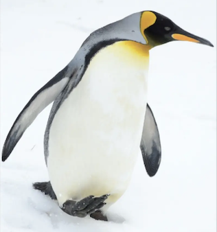
        
Source image

    

    

        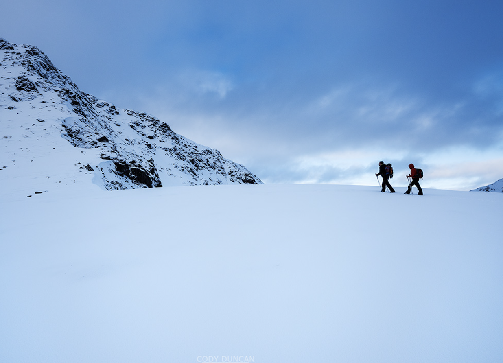
        
Target image

    

    

        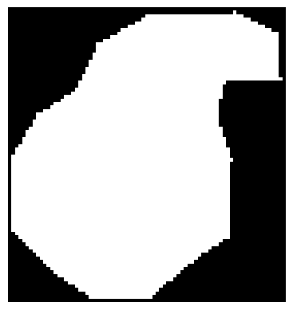
        
Mask

    

    

        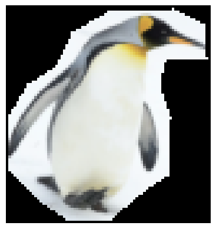
        
Source image in mask

    

    

        
        
Blend result

    

    

        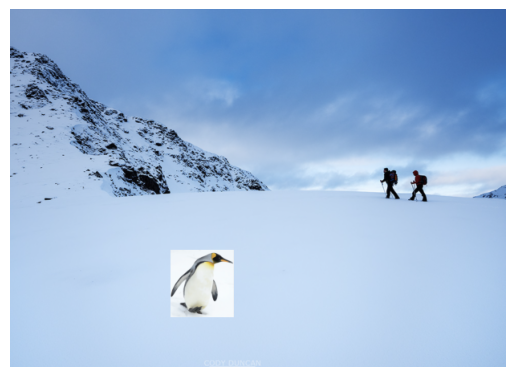
        
Naive result pasting source image directly into target image

    

Here are results for a hot air balloon and a beach.

    

        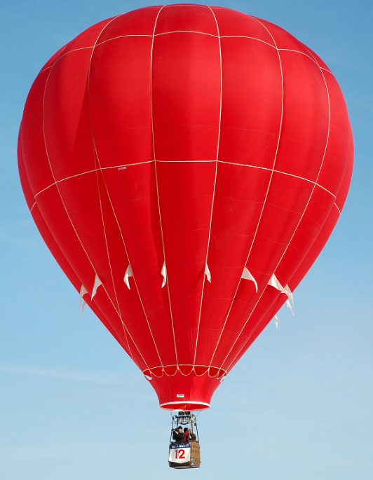
        
Source image

    

    

        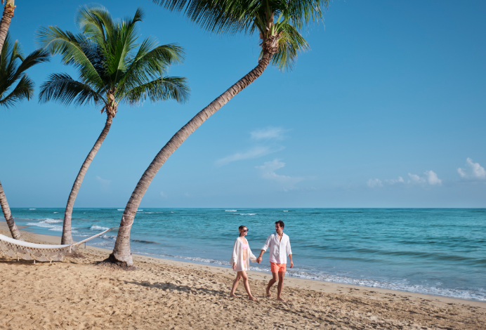
        
Target image

    

    

        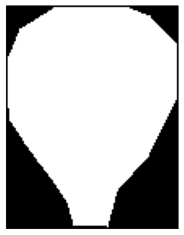
        
Mask

    

    

        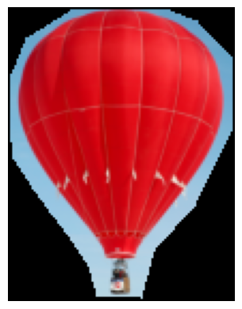
        
Source image in mask

    

    

        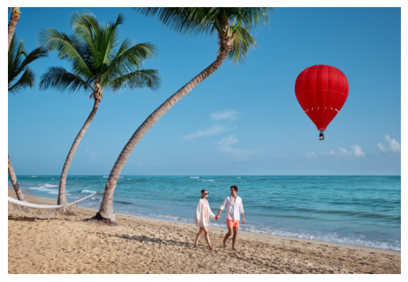
        
Blend result

    

    

        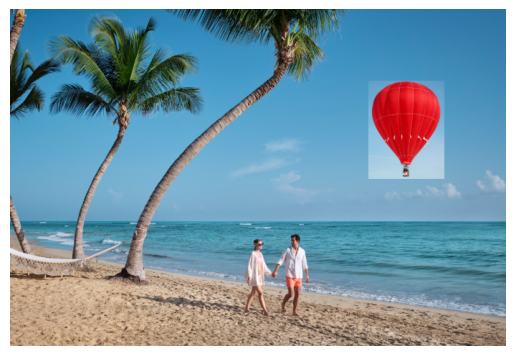
        
Naive result pasting source image directly into target image

    

Here are results for a cat and grass.

    

        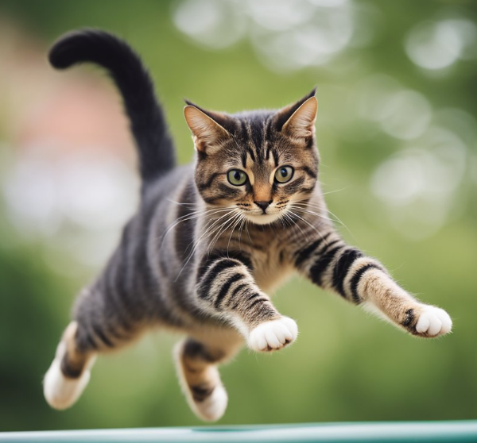
        
Source image

    

    

        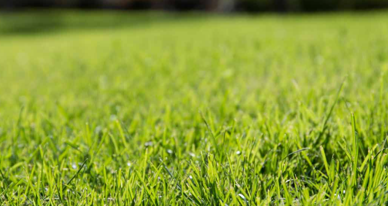
        
Target image

    

    

        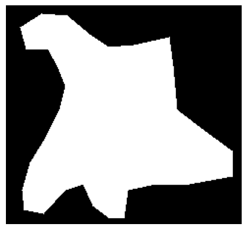
        
Mask

    

    

        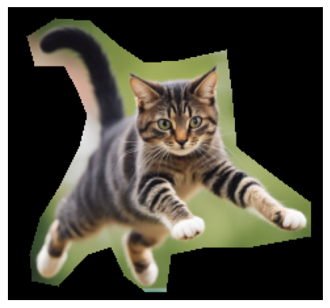
        
Source image in mask

    

    

        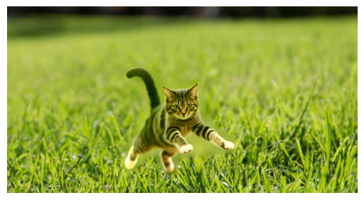
        
Blend result

    

    

        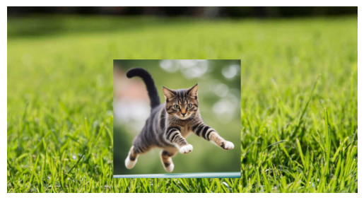
        
Naive result pasting source image directly into target image

    

As we can see, the Poisson blending is effective at smoothly blending one image into another. There are some small issues at places where I did not draw the mask as tightly around the source region as I should have, such as between the cat's front legs and on the left side of the penguin image between its flipper and body. However, the rest of the blending seemed to work well, and I think these images would have blended a little better if the mask was tighter around the object. I followed the project spec when it said that "Object region selection can be done very crudely, with lots of room around the object."

## Bells & Whistles: Mixed Gradients
Instead of using the gradients in the source image as the reference, we use either the gradient in the source image or target image, whichever has larger magnitude. The equation is as follows:

    

        
        
Equation from project spec

    

Here `d_ij` is the value of the gradient from the source or the target image with larger magnitude. If `abs(s_i-s_j) > abs(t_i-t_j)`, then `d_ij = s_i-s_j`; otherwise, `d_ij = t_i-t_j`.

The algorithm for mixed gradients was very similar to the algorithm to Poisson blending, but with just this one change (using `d_ij`) in the loop over the pixels.

Here are the results using mixed gradients.

    

        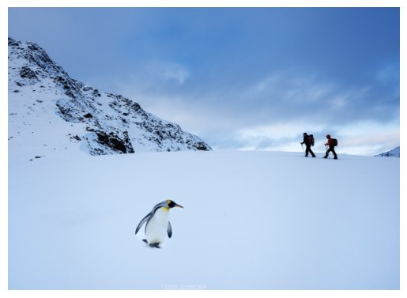
        
Penguin on snowy mountain

    

    

        
        
Hot air balloon and beach

    

    

        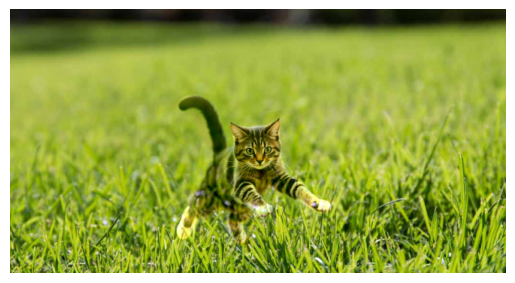
        
Cat on grass

    

The penguin/mountain and hot air ballon/beach blends seem very similar to what they were before I added mixed gradients. They were already pretty good before, so I was not expecting too much new improvement from mixed gradient blending.

The cat/grass blend is better than before in that the blurry patch between its front legs is no longer there, but it got a little worse since the cat's body past its midsection seems to have faded out a bit. I believe this is because the cat's body is a bit blurred in the original cat photo, so the gradients there are low and get replaced by the gradients in the grass image, causing the cat to appear a bit see-through since some of its pixels got replaced by grass pixels. I think mixed gradient blending would work better if the entire desired object was in clear focus in the source image, like in the penguin and hot air balloon, so then the gradients on the desired region would be higher and would be preserved in mixed gradient blending.

I tried mixed gradient blending again on the cat and grass, this time moving the cat so that it would be closer to the blurred section of the grass where its gradients might be greater than the grass's gradients.

    

        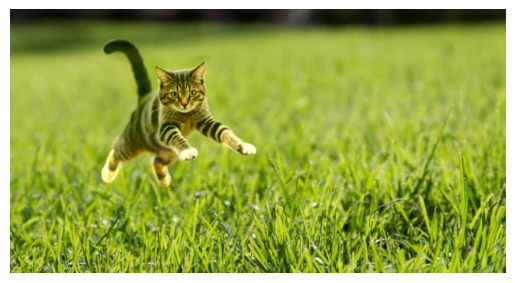
        
Cat (moved) on grass

    

The result here is better! The cat is less see-through since its gradients were greater than the gradients of the blurred grass. Very cool!
