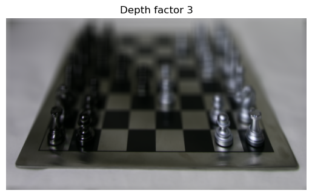
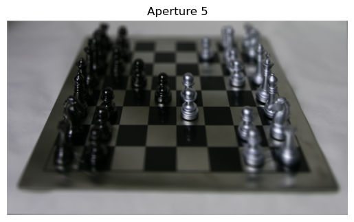
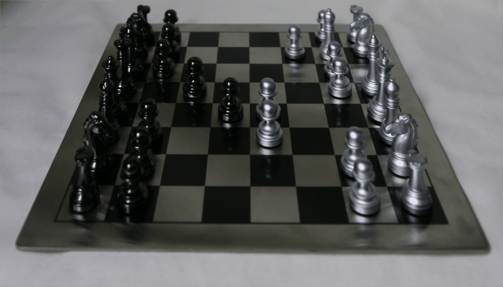

# Final Project
I did the Light Field Camera project and the Gradient Domain Fusion project. I switch between "I" and "we" as well as past and present tense in this website. Sorry!

# Light Field Camera
## Part 1: Depth Refocusing
I used the [Stanford Light Field Archive](http://lightfield.stanford.edu/lfs.html) chess dataset, which contained 289 rectified images that were taken with locations in a 17x17 grid. Each image was of shape `(800, 1400, 3)`. I read in all the images and arranged it into a `np.array` of shape `(17, 17, 800, 1400, 3)`, where the first two dimensions described the location of the image where it was taken.

I used the following procedure to refocus my images:
1. Get the position of the center image in the 17x17 grid, which was `(8, 8)`.
2. For every other image positioned at `(i, j)` in the dataset, calculate the horizontal and vertical distances between that image and the center image by doing `x_dist = j - center[1]` and `y_dist = i - center[0]`.
3. Scale these distances by some depth factor `depth_factor` to produce the shift offsets `x_shift` and `y_shift`, calculated as `x_shift = int(x_dist * depth_factor)` and `y_shift = -int(y_dist * depth_factor)`.
4. Shift the image using `np.roll` with the `x_shift` and `y_shift` from the previous step.
5. After doing steps 2-4 for all images (except for the center image), average all the shifted image results from step 4.

I chose to control the depth refocusing using a linear depth factor rather than the `alpha` term from the paper, since it found a linear factor to be easier to control, more simple, and more understandable/intuitive.

Here are my results using different depth factors.

    

        
        
 

    

    

        
        
 

    

    

        
        
 

    

    

        
        
 

    

Here is a gif showing the refocusing variation from depth factor 0 to depth factor 3. We can see that it looks like the camera is shifting its focus from the back right corner to the front left corner.

    

        
        
 

    

## Part 2: Aperture Adjustment
In the previous part, there was a significant amount of blur on the chessboard for portions of the image that were not in focus. The depth refocusing procedure mimicked a camera with a large aperture because it accounted for images that were at positions relatively far from the center reference image. We can mimic a camera with a smaller aperture by ignoring images that are too far from the center reference image based on some `aperture` parameter.

To emulate taking photos with different camera apertures, I modified the procedure for depth refocusing to only take into account images that were within a certain distance of the center image. I changed the `refocus_depth` method to take in an `aperture` argument. During the iteration through the 17x17 array of images, I added a check to skip images that were more than `aperture` grid positions away from the center position `(8, 8)`. For each image at position `(i, j)`, I checked whether `abs(i - center[0]) > aperture or abs(j - center[1]) > aperture`; if true, I skipped the image and did not use it when calculating the final result.

Here are my result using different `aperture` values. For all images in this part, I used a depth factor of 1.5 to focus on the center of the image.

    

        
        

    

    

        
        

    

    

        
        

    

    

        
        

    

We can indeed see that as the aperture grows larger, the image becomes more blurry around the edges.

Here is a gif showing the aperture variation from `aperture=1` to `aperture=7`.

    

        
        
 

    

## Summary
I thought this project was really interesting! I liked getting to see how we could refocus depth by post-processing images that were taken with locations in a grid, and I also enjoyed visualizing the effect of aperture size on images.

# Gradient Domain Fusion
For the Poisson blending portion of this project, I used the `poly2mask` function from the starter code in UIUC's version of the project [linked here](https://courses.grainger.illinois.edu/cs445/fa2023/projects/gradient/ComputationalPhotography_ProjectGradient.html), which I found while browsing submissions from students in Fall 2023. I only used this one method of the starter code to help generate binary masks for my images, since I did not want to draw my masks manually and I did not use the MATLAB starter code.

## Part 1: Toy Problem
In this part, our goal is to reconstruct the Toy Story image using information from the image's gradients. The idea is that we can think of trying to solve a differential equation, where we can find an exact solution if we match the derivatives at every point and also satisfy an initial condition. In this part, we can reconstruct the Toy Story image (i.e. solve the differential equation) by requiring that all the x-gradients and y-gradients of our new image match the x-gradients and y-gradients of the original image, and also by requiring that the value of the top left corners in the new and original images are the same (this is the initial condition to the differential equation).

## Part 2: Poisson Blending

## Bells & Whistles: Mixed Gradients

## Part 1.3: One-Step Denoising
We used the DeepFloyd stage 1 UNet to denoise the image by estimating the noise in the image and then removing it. We got the estimate of the clean image by rearranging the equation above to be an expression for $$x_0$$ in terms of $$x_t$$ (the noised image) and $$\epsilon$$ (the estimated noise from the UNet output).

    

    

        
        
Original Campanile

    

    

    

        
        
Noisy Campanile at t=250

    

    

        
        
Noisy Campanile at t=500

    

    

        
        
Noisy Campanile at t=750

    

    

        
        
One-step denoising at t=250

    

    

        
        
One-step denoising at t=500

    

    

        
        
One-step denoising at t=750

    

## Part 1.4: Iterative Denoising
The results were much better with one-step denoising compared to classical denoising, but the still performance degraded as more noise was added to the image. We used iterative denoising to address this issue. We created a list `strided_timesteps` of monotonically decreasing timesteps, starting at 990 and ending at 0 in 30 step increments. Thus, `strided_timesteps[0]` corresponded to pure noise, and `strided_timesteps[-1]` to the clean image. On the `i`th denoising step at `t = strided_timesteps[i]`, we get to `t' = strided_timesteps[i+1]` (slightly less noisy) using the following formula:

$$
x_{t'} = \frac{\sqrt{\bar{\alpha}_{t'} \beta_t}}{1 - \bar{\alpha}_t} x_0 + \frac{\sqrt{\alpha_t (1 - \bar{\alpha}_{t'})}}{1 - \bar{\alpha}_t} x_t + v_\sigma
$$

The variables are defined in the spec. $$v_\sigma$$ is random noise that we add via `add_variance`, defined for us in the starter code. We implemented the function `iterative_denoise(image, i_start)`, where `image` is a noisy image and `i_start` is the index at which we start at in `strided_timesteps` (i.e. how noised the image is). We added noise to the image using `t=strided_timesteps[10]` and then ran `iterative_denoise` on the image using `i_start=0` for the results below.

    

        
        
Noisy Campanile at t=90

    

    

        
        
Noisy Campanile at t=240

    

    

        
        
Noisy Campanile at t=390

    

    

        
        
Noisy Campanile at t=540

    

    

        
        
Noisy Campanile at t=690

    

    

        
        
Original Campanile

    

    

        
        
Iteratively denoised Campanile

    

    

        
        
One-step denoised Campanile

    

    

        
        
Gaussian blurred Campanile

    

## Part 1.5: Diffusion Model Sampling
Now, we can generate images from scratch by setting `i_start=0` in the call to `iterative_denoise` and passing in pure noise. This effectively denoises pure noise to create a new image. We did this on the prompt "a high quality photo". Here are 5 sampled images.

    

        
        

    

    

        
        

    

    

        
        

    

    

        
        

    

    

        
        

    

## Part 1.6: Classifier-Free Guidance (CFG)
To further improve performance, we implemented classifier-free guidance. In CFG, we compute both a conditional and unconditional noise estimate, which are denoted $$\epsilon_c$$ and $$\epsilon_u$$ respectively. The new noise estimate using CFG is then

$$
\epsilon = \epsilon_u + \gamma (\epsilon_c - \epsilon_u)
$$

We use $$\gamma = 7$$, and we use an empty prompt `""` for unconditional guidance.

Here are images generated using CFG.

    

        
        

    

    

        
        

    

    

        
        

    

    

        
        

    

    

        
        

    

## Part 1.7: Image-to-image Translation
To make edits to existing images, we can take a real image, add noise to it, and then denoise it, following the SDEdit algorithm. The more noise we add, the more the model can be "creative" and generate something new (not in the original image). We use the noise levels `[1, 3, 5, 7, 10, 20]`, so we add noise using `forward(im, strided_timesteps[i_start])` and we denoise by passing in the appropriate `i_start` to `iterative_denoise_cfg`.

I did this process on the Campanile image, as well as images of a dog and a tree.

    

        
        
SDEdit with i_start=1

    

    

        
        
SDEdit with i_start=3

    

    

        
        
SDEdit with i_start=5

    

    

        
        
SDEdit with i_start=7

    

    

        
        
SDEdit with i_start=10

    

    

        
        
SDEdit with i_start=20

    

    

        
        
Campanile

    

    

        
        
SDEdit with i_start=1

    

    

        
        
SDEdit with i_start=3

    

    

        
        
SDEdit with i_start=5

    

    

        
        
SDEdit with i_start=7

    

    

        
        
SDEdit with i_start=10

    

    

        
        
SDEdit with i_start=20

    

    

        
        
Dog

    

    

        
        
SDEdit with i_start=1

    

    

        
        
SDEdit with i_start=3

    

    

        
        
SDEdit with i_start=5

    

    

        
        
SDEdit with i_start=7

    

    

        
        
SDEdit with i_start=10

    

    

        
        
SDEdit with i_start=20

    

    

        
        
Tree

    

## Part 1.7.1: Editing Hand-Drawn and Web Images
We experimented with hand-drawn and other non-realistic images using our diffusion model. We followed the same process as described above, using noise levels `[1, 3, 5, 7, 10, 20]` to noise and denoise images.

I did this on an image of tree clip art, as well as my hand-drawn images of an apple and the sky. The yellow-ish circle in the sky image is supposed to be the Sun, although I don't think it came across very well after the code compressed my hand-drawn image.

    

        
        
SDEdit with i_start=1

    

    

        
        
SDEdit with i_start=3

    

    

        
        
SDEdit with i_start=5

    

    

        
        
SDEdit with i_start=7

    

    

        
        
SDEdit with i_start=10

    

    

        
        
SDEdit with i_start=20

    

    

        
        
Tree Clip Art

    

    

        
        
SDEdit with i_start=1

    

    

        
        
SDEdit with i_start=3

    

    

        
        
SDEdit with i_start=5

    

    

        
        
SDEdit with i_start=7

    

    

        
        
SDEdit with i_start=10

    

    

        
        
SDEdit with i_start=20

    

    

        
        
Hand-Drawn Apple

    

    

        
        
SDEdit with i_start=1

    

    

        
        
SDEdit with i_start=3

    

    

        
        
SDEdit with i_start=5

    

    

        
        
SDEdit with i_start=7

    

    

        
        
SDEdit with i_start=10

    

    

        
        
SDEdit with i_start=20

    

    

        
        
Hand-Drawn Sky

    

## Part 1.7.2: Inpainting
We can use our model to inpaint, where we mask out one part of an image and use the model to fill it in. Given an image `x_orig` and a binary mask `m`, we can create a new image that has the same content where `m` is 0 and new content wherever `m` is 1. We run the diffusion denoising loop, but after every step, we "force" `x_t` to have the same pixels as `x_orig` where m is 0:

$$
x_t \leftarrow mx_t + (1 - m) \text{forward}(x_{orig}, t)
$$

I inpainted the top of the campanile, as well as a photo of my brother and the Seattle Space Needle.

    

        
        
Campanile

    

    

        
        
Mask

    

    

        
        
Hole to fill

    

    

        
        
Campanile inpainted

    

    

        
        
Brother

    

    

        
        
Mask

    

    

        
        
Hole to fill

    

    

        
        
Brother inpainted

    

    

        
        
Space needle

    

    

        
        
Mask

    

    

        
        
Hole to fill

    

    

        
        
Space needle inpainted

    

## Part 1.7.3: Text-Conditional Image-to-image Translation
We followed the procedure described in part 1.7, but we changed the prompt to be one of the precomputed prompts instead of "a high quality photo". This makes the image look more like the text prompt at higher noise levels (since the model can be more creative when there is more noise).

Here is the text prompt "a rocket ship" and the Campanile image.

    

        
        
Rocket ship at noise level 1

    

    

        
        
Rocket ship at noise level 3

    

    

        
        
Rocket ship at noise level 5

    

    

        
        
Rocket ship at noise level 7

    

    

        
        
Rocket ship at noise level 10

    

    

        
        
Rocket ship at noise level 20

    

    

        
        
Campanile

    

Here is the text prompt "a photo of a dog" and a squirrel image.

    

        
        
A photo of a dog at noise level 1

    

    

        
        
A photo of a dog at noise level 3

    

    

        
        
A photo of a dog at noise level 5

    

    

        
        
A photo of a dog at noise level 7

    

    

        
        
A photo of a dog at noise level 10

    

    

        
        
A photo of a dog at noise level 20

    

    

        
        
Squirrel

    

Here is the text prompt "a photo of a man" and a tree image.

    

        
        
A photo of a man at noise level 1

    

    

        
        
A photo of a man at noise level 3

    

    

        
        
A photo of a man at noise level 5

    

    

        
        
A photo of a man at noise level 7

    

    

        
        
A photo of a man at noise level 10

    

    

        
        
A photo of a man at noise level 20

    

    

        
        
Tree

    

## Part 1.8: Visual Anagrams
We denoise an image at step `t` normally using one prompt to get noise estimate $$\epsilon_1$$. At the same time, and we flip the image upside down and denoise it using another prompt to get noise estimate $$\epsilon_2$$. We then flip $$\epsilon_2$$ back so it is right-side up, and we average the two noise estimates. We then perform a denoising diffusion step with the averaged noise estimate.

We implemented the algorithm as described in the spec.

Here is an anagram from the prompts `'an oil painting of an old man'` and `'an oil painting of people around a campfire'`.

    

        
        
An oil painting of an old man

    

    

        
        
An oil painting of people around a campfire

    

Here is an anagram from the prompts `'a photo of a dog'` and `'a photo of a man'`.

    

        
        
A photo of a dog

    

    

        
        
A photo of a man

    

Here is an anagram from the prompts `'an oil painting of a snowy mountain village'` and `'an oil painting of people around a campfire'`.

    

        
        
An oil painting of a snowy mountain village

    

    

        
        
An oil painting of people around a campfire

    

## Part 1.9: Hybrid Images
We can create hybrid images by combining the low and high frequencies of two different noise estimates from different text prompts. We denoise an image at step `t` using one prompt to get noise estimate $$\epsilon_1$$ and using another prompt to get noise estimate $$\epsilon_2$$. Then, we get the combined noise estimate using $$f_{\text{lowpass}}(\epsilon_1) + f_{\text{highpass}}(\epsilon_2)$$.

Here is the hybrid image from the prompts "a lithograph of a skull" (low pass) and "a lithograph of waterfalls" (high pass).

    

        
        

    

    

        
        

    

Here is the hybrid image from the prompts "a lithograph of a skull" (low pass) and "a lithograph of houseplants" (high pass).

    

        
        

    

    

        
        

    

Here is the hybrid image from the prompts "a lithograph of a panda" (low pass) and "a lithograph of houseplants" (high pass).

    

        
        

    

    

        
        

    

# Project 5B: Diffusion Models from Scratch
## Part 1: Training a Single-Step Denoising UNet

We implemented the Single-Step Denoising UNet as specified by the process described in Part 1.1 of the project spec. 

To train this denoiser, we need to generate training data pairs of $$(z, x)$$ where each $$x$$ is a clean MNIST digit and $$z$$ is a noised version. We use the following:

$$
z = x + \sigma \epsilon, \epsilon \sim \mathcal{N}(0, 1)
$$

Here is a visualization of the noising processes over $$\sigma = [0.1, 0.2, 0.4, 0.5, 0.6, 0.8, 1.0]$$, with normalized $$x \in [0, 1]$$. Each column corresponds to a sigma value in the list, in the order they are listed.

    

        
        

    

I trained the UNet to denoise noisy image $$z$$ with $$\sigma = 0.5$$ applied to clean image $$x$$. I used batch size 256, hidden dimension `D = 128`, and Adam optimizer with learning rate `1e-4`. I trained for 5 epochs. I used L2 loss between the denoised image output from the UNet and the clean image $$x$$.

Here is the graph of training losses.

    

        
        

    

Here are sample results on the test set after the 1st epoch of training. The first column is the original clean image, the second column is the noisy image using $$\sigma=0.5$$, and the third column is the model output from denoising the noisy image.

    

        
        

    

Here are sample results on the test set after the 5th epoch of training. Again, the first column is the original clean image, the second column is the noisy image using $$\sigma=0.5$$, and the third column is the model output from denoising the noisy image.

    

        
        

    

We tested the model on MNIST images that were noised with different $$\sigma$$ values to see how well it performed on out-of-distribution data. Here are the results for $$\sigma = [0.0, 0.2, 0.4, 0.5, 0.6, 0.8, 1.0]$$

    

        
        

    

## Part 2: Training a Diffusion Model
### Time Conditioning
We implemented the UNet with time conditioning according to the details and architecture specified in the project spec. Instead of a separate UNet for each timestep, we trained a model to be conditioned on the timestep. We added fully connected blocks for embedding the timestep into the up-layers of the UNet.

This model predicts a noise estimate rather than the denoised image directly. We use L2 loss over the predicted noise using the model and the actual noise added to the image.

Now, we noise images using the following formula:

$$
x_t = \sqrt{\bar{\alpha}_t} x_0 + \sqrt{1 - \bar{\alpha}_t} \epsilon, \epsilon \sim \mathcal{N}(0, 1)
$$

We want $$x_t$$ at $$t=0$$ to be the clean image and $$x_t$$ at $$t=T$$ to be pure noise. We create the beta, alpha_t, and alpha_t_bar lists as described in the spec. We use $$T=300$$ as the total number of timesteps.

We trained the model $$\epsilon_\theta (x_t, t)$$ to predict the noise in $$x_t$$ given a noisy image $$x_t$$ and timestep $$t$$. We used batch size 128, hidden dimension `D = 64`, and Adam optimizer with initial learning rate of `1e-3`. We also used an exponential learning rate decay scheduler with gamma $$0.1^{1/\text{num_epochs}}$$. We trained for 20 epochs. We normalized $$t$$ before passing it into the forward pass of the UNet.

Here is the training loss curve.

    

        
        

    

Here are the sampling results from the time-conditional UNet at epochs 5, 10, and 20.

    

        
        
Epoch 5

    

    

        
        
Epoch 10

    

    

        
        
Epoch 20

    

## Class Conditioning
To improve performance, we also condition the UNet on the class of the digit 0-9. To do this, we add two more fully connected blocks to the UNet architecture that take in a one-hot vector for the class of the digit. Because we still want the model to work without class conditioning, we use a mask such that 10% of the time, we drop the class conditioning vector by setting it to 0. For training this model, we use the same hyperparameters and learning rate scheduler as in the time conditioning case. We implement the class conditioning by following the procedure specified in the project spec.

Here is the training loss curve for the class conditional model.

    

        
        

    

Here are the sampling results from the class-conditional UNet at epochs 5 and 20.

    

        
        
Epoch 5

    

    

        
        
Epoch 20

    

